# Adaptive Business OS v1 Specification

- **Specification version:** `1.0.0`
- **Status:** Owner-approved, implementation-ready v1 baseline
- **Tracker disposition:** `ready-for-agent` for Gate 9 ticket creation
- **Owner decision date:** 2026-08-02
- **Scope:** Local, fictitious, sandbox-only retail plus cafe reuse proof
- **Authority boundary:** This specification authorizes planning the next
  implementation tickets. It does not authorize production implementation,
  deployment, real data, billing, external integrations, or public release.

## 1. Problem Statement

Small and medium businesses repeatedly need the same foundations—identity,
data, backend behavior, interfaces, purchasing, sales, stock, cash, accounting,
reports, and guided setup—but each client engagement currently becomes a new
custom system. That repeats code, burns time and model tokens, produces forks,
and makes shared corrections difficult.

The part that legitimately differs is the business intent: what the business
does, which Records and Workflows it needs, who performs governed actions, what
Evidence is required, and how each Role should experience the system. A cafe
needs an order-to-kitchen experience; a retailer needs purchasing, receiving,
stock, and sales. Those differences must not require separate authorization,
ledger, inventory, lifecycle, or deployment logic.

The product therefore needs an intent-first operating model that:

1. interviews an owner in business language;
2. preserves facts, uncertainty, assumptions, constraints, sensitive-data
   boundaries, and desired outcomes without inventing truth;
3. proposes a complete, versioned, reviewable Business Blueprint;
4. requires explicit owner approval of one exact immutable Blueprint Version;
5. compiles only declared Governed Configuration;
6. lets one deterministic Business Kernel execute shared business invariants;
7. presents tailored retail and cafe Sandbox Experiences from that shared
   kernel; and
8. proves the result with executable fictitious scenarios, independently
   recomputable stock and ledger outcomes, deterministic evidence, and clean
   reset.

The central safety problem is authority confusion. An interview answer, model
output, preview, Human Gate, orchestration trace, validation result, or passing
test must never be mistaken for Blueprint Approval or governed business truth.
Only the Business Kernel may accept a typed Kernel Command and create the
authoritative result and effects declared by that action.

The v1 destination is reached when an Owner Interview produces a versioned
Intent Brief and Draft Blueprint, explicit Blueprint Approval authorizes one
exact version, one shared Business Kernel provisions tailored retail and cafe
Sandbox Experiences, both fixed business scenarios pass, and both targets
reset to clean-unapplied generations. The proof targets small and medium
businesses, but it does not yet define a commercial tier entitlement matrix.

## 2. Solution

Adaptive Business OS is a business-system compiler, not a prompt-to-code app
builder and not a Frappe-based ERP customization layer. AI may propose only
schema-declared Governed Configuration. Versioned platform code owns every
executable invariant.

```mermaid
flowchart LR
    O["Owner Interview"] --> I["Versioned Intent Brief"]
    I -->|"safe and traceable"| D["Immutable Draft Blueprint"]
    D --> R["Review bundle and Semantic Diff"]
    R --> G["Exact Human Gate decision"]
    G -->|"authorize unchanged command"| K["Business Kernel"]
    K --> A["Blueprint Approval"]
    A --> E["Target-neutral Effective Blueprint"]
    E --> P1["Retail preparation and activation"]
    E --> P2["Cafe preparation and activation"]
    P1 --> B1["Retail Sandbox Experience"]
    P2 --> B2["Cafe Sandbox Experience"]
    B1 --> V["Read-only acceptance evaluation"]
    B2 --> V
    V --> X["Content-identified evidence and clean reset"]
```



### 2.1 Owner intent

The Owner Interview uses a progressive Guided Cockpit: one material question at
a time, organized across eight fact families, with a recommended answer and
concrete alternatives. A persistent Draft preview keeps the current source,
Intent State, Sensitive Data Class, affected configuration, Semantic Diff, and
approval boundary visible. A complete Evidence Workbook is available before
approval for dense cross-family review.

The interview writes a versioned Intent Brief. Every material statement has
exactly one Intent State and attributable source. Every named data category has
one Sensitive Data Class, rationale, and source. Assumptions and Acceptance
Conditions use their full governed envelopes. Unsafe or structurally incomplete
intent produces a specific Draft Blocker and no Draft Blueprint.

### 2.2 Blueprint proposal and approval

Every Blueprint Version is a complete, immutable, self-contained snapshot under
one closed canonical schema. Editing always creates a new Draft with a new exact
Blueprint Reference. Canonical JSON and SHA-256 establish content equality;
they do not transfer identity, lineage, approval, compatibility, or runtime
state.

Blueprint Approval is an atomic Business Kernel result over one Approval
Eligible Draft, its exact Blueprint Reference, Content Identity, current review
bundle, and Approval Baseline. Interview completion, preview viewing, option
selection, equal content, or Human Gate authorization alone never counts as
approval.

### 2.3 Shared Business Kernel

The Business Kernel is the only executor of governed business truth. Its
always-active Kernel Foundation owns isolation, schema and identity validation,
Blueprint lifecycle and provisioning, authorization, Workflow and Evidence
enforcement, idempotency, causation, immutable effects, accounting, inventory,
reconciliation, Reversal, and Sandbox Reset.

One closed v1 Capability inventory supplies reusable business abilities. Retail
and cafe are Blueprint compositions and experience profiles, not vertical
Capabilities or generated applications. Configuration selects and narrows
declared behavior; it never installs tenant code, formulas, scripts, arbitrary
queries, authorization logic, posting maps, stock arithmetic, migrations, or
deployment instructions.

### 2.4 Tailored sandbox experiences

One exact Approved Blueprint selects the v1 Capability union and contains two
target profiles. A pure compiler produces one immutable, target-neutral
Effective Blueprint. Provisioning prepares retail and cafe independently and
atomically activates each target against its expected Applied Blueprint
baseline. The targets share Capability semantics while keeping all runtime
state isolated by Tenant, Sandbox Experience, Location, and Sandbox Generation.

Retail proves purchase, receipt, stock admission, Order, Sale, Payment, Cash,
and a balanced ledger. Cafe proves Menu Item and Modifier selection, Order,
Kitchen Ticket accepted → preparing → ready → fulfilled, Ingredient
Consumption only at first fulfillment, then shared Payment, Cash, Inventory,
and Ledger behavior.

### 2.5 Governed agent loop

The runtime separates three authorities:

- an Agent Run may interview, plan, explain, read permitted context, and propose;
- an Orchestration Run may persist control state, gates, budgets, attempts,
  failures, results, and observations; and
- the Business Kernel alone may accept Kernel Commands and create governed
  truth.

Human Gates are explicit, typed, durable decisions over one exact immutable
subject. They may unblock orchestration or authorize submission of one unchanged
Kernel Command. They never force command acceptance or substitute for the
Kernel result.

### 2.6 Evidence and completion

The acceptance evaluator is read-only. It observes exact durable sources against
predeclared Completion Conditions and returns Satisfied, Unsatisfied, or
Indeterminate. The Reference Slice report is `Passed` only when all Required
conditions are currently Satisfied, effects and budget reconcile, replay is
deterministic, and both targets finish in verified clean-unapplied generations.

`Passed` is prototype evidence, not owner acceptance of a future build,
production readiness, regulatory compliance, deployment permission, or an audit
opinion.

## 3. User Stories

### Owner Interview and intent capture

1. As an Owner, I want the interview to ask one material question at a time so
   that I can make deliberate decisions without losing the whole-system context.
2. As an Owner, I want a recommended answer plus concrete alternatives so that
   I am not forced to design the system from a blank page.
3. As an Owner, I want every answer attributed to its source and Intent State so
   that Confirmed intent is never confused with uncertainty or an AI proposal.
4. As an Owner, I want all eight required fact families represented so that a
   Draft cannot omit an important part of how the business operates.
5. As an Owner, I want a fact family to be marked Not Applicable only through my
   explicit decision so that omission cannot masquerade as irrelevance.
6. As an Owner, I want Unknown, Ambiguous, Conflicting, Assumed, and Unsupported
   statements to remain visible so that unresolved intent is never silently
   converted to Confirmed.
7. As an Owner, I want every named data category classified independently from
   its Intent State so that exposure decisions remain explicit.
8. As an Owner, I want mixed or unresolved data classifications handled at the
   most restrictive boundary so that AI cannot downgrade sensitive content.
9. As an Owner, I want Restricted data barred from external AI in v1 so that
   credentials, bank details, identity documents, and clinical data cannot leak
   through discovery.
10. As an Owner, I want each Assumption to show its proposition, source,
    rationale, affected scope, risk, resolution condition, reviewer, and expiry
    so that provisional intent is reviewable rather than hidden defaulting.
11. As an Owner, I want each Acceptance Condition to state an observable
    business outcome, scope, pass and failure conditions, required Evidence,
    reviewer, criticality, and dependencies so that the proposed system can be
    judged in business language.
12. As an Owner, I want a precise Draft Blocker explanation when intent is not
    safe or meaningful enough to propose so that the interview can continue
    without fabricating a Blueprint.
13. As an Owner, I want the Intent Brief version preserved after every material
    correction so that earlier statements and their attribution remain intact.
14. As an Owner, I want live credentials, card numbers, identity-document
    contents, and medical records excluded from the interview so that discovery
    captures categories and constraints rather than dangerous payloads.

### Blueprint review, identity, and lifecycle

15. As an Owner, I want every Blueprint Version to be a complete immutable
    snapshot so that I can review it without replaying earlier patches.
16. As an Owner, I want an edit to create a new Draft rather than mutate the
    prior version so that approval always refers to unchanged content.
17. As an Owner, I want the exact Tenant, Blueprint, and Version identities shown
    beside the owner-facing Version Number so that display labels cannot become
    authority.
18. As an Owner, I want deterministic Blueprint Content Identity verification
    so that the reviewed canonical content can be independently recomputed.
19. As an Owner, I want a schema-aware Semantic Diff from a declared baseline so
    that additions, removals, changes, reordering, exclusions, and
    non-comparable paths are explicit.
20. As an Owner, I want one closed eleven-section Blueprint schema so that
    retail and cafe use the same governed configuration language.
21. As an Owner, I want every material configured item traced to source intent,
    Acceptance Conditions, Assumptions, constraints, exclusions, or Unsupported
    requests so that configuration never loses its reason.
22. As an Owner, I want the Draft preview to show Capabilities, Locations,
    Records, Workflows, Roles, Evidence duties, policies, interfaces, reports,
    dashboards, integrations, and data exposure so that approval is informed.
23. As an Owner, I want blocking diagnostics to disable approval so that a
    warning acknowledgement cannot waive a Kernel invariant.
24. As an Owner, I want no active configuration to depend on an Assumption or
    other non-Confirmed intent so that approval never confirms uncertainty
    implicitly.
25. As an Owner, I want Blueprint Approval to name one exact Reference, Content
    Identity, review bundle, and Approval Baseline so that it cannot transfer to
    another version.
26. As an Owner, I want stale review material to fail closed while leaving the
    Draft intact so that concurrent work is not discarded or silently rebased.
27. As an Owner, I want multiple immutable Drafts to coexist so that parallel
    proposals can be compared without overwriting one another.
28. As an Owner, I want Rejected, Superseded, and Withdrawn histories preserved
    so that lifecycle truth remains attributable and terminal.
29. As an Owner, I want restoring historical configuration to create a new Draft
    through ordinary review and approval so that Reversion never reactivates old
    authority.
30. As an Owner, I want compatibility evaluated separately for each Sandbox
    target so that partial support is never presented as whole-system support.

### Governed configuration and shared capabilities

31. As a Platform Maintainer, I want the Kernel Foundation always active and
    non-selectable so that a Blueprint cannot weaken isolation, authority, audit,
    or lifecycle rules.
32. As an Owner, I want to compose my experience from declared Capabilities so
    that retail and cafe can differ without separate applications.
33. As a Platform Maintainer, I want every Capability and Configuration Schema
    pinned to an exact version so that `latest`, ranges, and aliases cannot alter
    reviewed meaning.
34. As an Owner, I want configuration limited to typed Configuration Points so
    that AI can tailor the experience without generating executable tenant code.
35. As an Owner, I want supplemental fields limited to declared typed slots so
    that extra business information cannot become hidden computation.
36. As an Owner, I want Workflow variations limited to declared templates,
    states, transitions, predicates, Roles, and Evidence so that free text cannot
    become a runtime process.
37. As an Owner, I want Role configuration to restrict declared governed actions
    and scope without implementing authorization so that presentation and
    permissions remain distinct.
38. As an Owner, I want Policy Profiles to select implemented behavior within
    fixed bounds so that formulas, posting logic, stock arithmetic, and tax code
    remain Kernel-owned.
39. As an Owner, I want Role-specific navigation, forms, layouts, copy, reports,
    and dashboards to reference only enabled Capability content so that the UI
    cannot invent business truth.
40. As a Platform Maintainer, I want unknown properties, unsupported versions,
    unresolved references, scripts, prompts, SQL, formulas, arbitrary endpoints,
    and authority-boundary attempts rejected so that configuration fails closed.
41. As a Platform Maintainer, I want one target-neutral Effective Blueprint so
    that retail and cafe derive from the same validated configuration without
    sharing mutable runtime state.
42. As an Owner, I want each Sandbox Experience activated independently through
    prepare-then-activate provisioning so that one target's failure cannot
    corrupt or falsely satisfy the other.

### Retail business operation

43. As a Buyer, I want to confirm a Purchase Order for a supplier, Location,
    items, units, frozen acquisition prices, and currency so that purchasing
    intent is durable without creating stock or ledger effects.
44. As a Receiver, I want to accept an attributable Supplier Receipt against a
    confirmed Purchase Order so that stock admission and payable recognition
    occur only after receipt Evidence passes.
45. As a Receiver, I want cumulative receipts constrained by the ordered
    quantity so that over-receipt fails without partial effects.
46. As a Retail Cashier, I want to accept a customer Order with frozen item,
    quantity, price, currency, counterparty, and Location so that commercial
    intent is distinct from fulfillment.
47. As a Retail Cashier, I want the first valid Sale fulfillment to atomically
    issue stock and post receivable, revenue, cost, and Inventory effects so that
    physical and financial truth agree.
48. As a Retail Cashier, I want fulfillment rejected when stock, state, unit,
    currency, Blueprint, or scope is invalid so that no partial Sale survives.
49. As a Retail Cashier, I want a cash Payment allocated separately to the Sale
    receivable so that Payment is never conflated with Order or Sale.
50. As a Retail Cashier, I want a permitted partial Payment to retain an exact
    positive residual and an excess Payment to be rejected so that v1 never
    invents a write-off or undeclared customer-credit account.
51. As an Owner, I want Cash Position and the trial balance recomputed from
    immutable accepted effects so that neither can be edited as independent
    truth.
52. As an Owner, I want the retail Golden Transaction to end at the fixed stock,
    cash, cost, payable, revenue, and balanced-ledger literals so that reuse is
    proven against predeclared outcomes.

### Cafe business operation

53. As a Cafe Cashier, I want to accept one Menu Item with declared Modifiers so
    that the Order freezes both selling price and ingredient requirements.
54. As a Kitchen Operator, I want a Kitchen Ticket to progress through accepted,
    preparing, ready, and fulfilled so that preparation state is explicit.
55. As a Kitchen Operator, I want accepted, preparing, and ready to create no
    ingredient or financial effect so that work-in-progress does not become
    fulfillment truth.
56. As a Kitchen Operator, I want the first fulfilled transition to atomically
    consume frozen ingredient quantities and recognize the Sale so that stock,
    cost, receivable, and revenue share one causal occurrence.
57. As a Kitchen Operator, I want insufficient stock, unit mismatch, changed
    snapshot, invalid state, or posting failure to reject the whole fulfillment
    so that partial consumption never survives.
58. As a Cafe Cashier, I want cafe Payment, allocation, Cash, and Ledger behavior
    to use the exact shared Capability semantics as retail so that cafe does not
    acquire a forked finance engine.
59. As an Owner, I want owner-facing cost described as ingredient cost so that
    the system does not imply labour, overhead, waste, yield, or full recipe
    costing.
60. As an Owner, I want the cafe scenario to end at the fixed ingredient,
    Inventory, cash, payable, revenue, cost, and balanced-ledger literals so that
    order-to-kitchen reuse is objectively demonstrated.

### Authority, orchestration, and correction

61. As an Owner, I want a Human Gate to bind one exact immutable subject and a
    closed response list so that inactivity, inferred sentiment, or an operator
    edit cannot count as my decision.
62. As an Owner, I want Authorize Submission to state its effect and non-effect
    so that I know the Business Kernel may still reject the command.
63. As an Operator, I want an Orchestration Run to resume from durable state only
    when versions, artifacts, gates, budgets, and Kernel baselines remain fresh
    so that interrupted work cannot silently migrate.
64. As an Operator, I want each Agent Run attempt immutable and uniquely
    identified beneath one Orchestration Run so that retry and resume preserve
    history.
65. As an Operator, I want each Kernel Command to be immutable,
    content-identified, and idempotent so that a lost response or retry cannot
    duplicate governed effects.
66. As an Operator, I want durable Accepted or Rejected Kernel Command Results
    so that delivery ambiguity is resolved by lookup before retry.
67. As an Operator, I want monotonic hard Run Budget ceilings so that model,
    tool, retry, command-delivery, time, and measurable spend exposure is bounded.
68. As an Owner, I want a Budget Gate to authorize only one bounded amendment
    without resetting usage so that budgets cannot become hidden authority.
69. As an Operator, I want deterministic Failure Classes and stable codes so
    that retry, correction, human recovery, and terminal failure cannot be
    improvised by model output.
70. As an Owner, I want every correction forward-only and attributable so that
    a failed proposal or governed effect is never edited out of history.
71. As a Reviewer, I want a Reversal to create linked opposite financial
    effects without automatically restoring stock so that commercial,
    Payment, and physical correction remain distinct.
72. As a Reviewer, I want original-effect and reset execution duties separated
    from their sole reviewer or authorizer so that mandatory separation of duty
    cannot be weakened by configuration.

### Isolation, evidence, reset, and acceptance

73. As an Owner, I want retail and cafe runtime facts isolated by exact Tenant,
    target, Location, generation, Role scope, and Applied Blueprint so that a
    shared kernel never implies shared business state.
74. As a Reviewer, I want a separate empty sentinel Tenant used for denial tests
    so that cross-Tenant isolation is executable evidence rather than an
    assertion.
75. As a Reviewer, I want reads, reports, reconciliations, and Sandbox Exports
    scoped by the same authority dimensions as commands so that data cannot leak
    through observation.
76. As an Owner, I want every fixture value visibly fictitious and independently
    classified so that prototype evidence can never be mistaken for customer
    data.
77. As a Reviewer, I want every accepted effect linked to one Business Event,
    command, source, policy, Blueprint, and scope so that causation is complete.
78. As a Reviewer, I want ledger, stock, Inventory control, cash, Payment, and
    causation invariants independently recomputed so that a stored projection or
    UI total cannot prove itself.
79. As an Owner, I want each Sandbox Export deterministic, content-identified,
    scoped, minimized, and read-only so that evidence cannot become an import,
    backup, or execution channel.
80. As an Owner, I want Sandbox Reset to require a fresh explicit authorization
    and an isolated prepared replacement generation so that destructive action
    is intentional and target-specific.
81. As an Owner, I want reset to preserve governance history while replacing
    fictitious runtime truth so that the system can explain what happened after
    a clean run.
82. As a Reviewer, I want the exact fixture to replay after reset with identical
    business outcomes so that idempotency and deterministic rules are proven.
83. As a Reviewer, I want Required conditions to fail closed as Unsatisfied or
    Indeterminate so that partial success and missing evidence cannot become a
    pass.
84. As an Owner, I want the one-command run to finish only after both targets are
    observed clean and unapplied so that completion cannot hide partial reset.

## 4. Implementation Decisions

### 4.1 Normative authority model

1. AI proposes only Governed Configuration declared by closed Configuration
   Schemas. It may propose Capabilities, fields, forms, layouts, Roles, Workflow
   arrangements, reports, dashboards, explanations, and copy.
2. AI may not invent arbitrary tenant runtime code, authorization enforcement,
   ledger posting, stock arithmetic, approval truth, destructive migrations,
   Sandbox Reset authority, or production deployment.
3. No interface, Agent Run, Orchestration Run, adapter, configured Workflow, or
   direct Store write may mutate governed state. All governed mutations pass as
   typed Kernel Commands through the Business Kernel.
4. A Human Gate decision may authorize submission of one unchanged command. It
   never forces acceptance or creates the resulting governed fact.
5. A Business Event exists only after the Business Kernel accepts the causing
   command. Rejected commands create no Business Event or governed effect.

### 4.2 Intent Brief contract

Every material statement has exactly one of these Intent States: Confirmed,
Unknown, Ambiguous, Conflicting, Assumed, Not Applicable, or Unsupported. Draft
generation may retain unresolved states visibly, but active approval-eligible
configuration may depend only on Confirmed intent or a fixed Kernel invariant.

The eight required fact families are:

1. purpose and scope;
2. safety and jurisdiction;
3. business shape;
4. customer and fulfillment journey;
5. supply, stock, and capacity;
6. people and governance;
7. money and accounting; and
8. experience and integrations.

Every family must be represented; only an explicit owner decision may make it
Not Applicable.

Sensitive Data Classes are Public, Internal, Confidential, and Restricted.
Mixed data inherits the most restrictive class. Unknown, Ambiguous, or
Conflicting classification is handled as Restricted. Public may be eligible for
external AI; Internal additionally needs a declared provider policy,
minimization, and explicit owner approval; Confidential additionally needs
supported jurisdiction/handling and redaction or minimization; Restricted never
goes to an external AI provider in v1.

An Assumption preserves the exact proposition, proposer, source, recorded time,
rationale, affected fact families and proposals, consequence if false,
resolution condition, expected Evidence, reviewer, and any trigger or expiry. It
may shape only visible provisional alternatives and may never establish safety,
authorization, financial or stock truth, approval, migration, reset, or
deployment authority.

An Acceptance Condition preserves its owner-valued outcome, importance, scope,
starting context, governed action, observable result, pass and failure
conditions, Evidence, reviewer, Required or Desired criticality, and dependent
Assumptions, constraints, or Sensitive Data Classes.

A Draft Blocker exists when required coverage, state, source, or classification
is missing; no Confirmed purpose and Confirmed Required Acceptance Condition
anchor the proposal; Tenant or business scope prevents safe scoping; safety,
jurisdiction, or data handling is unsupported; a Required condition would need
invented governed truth; or affected scope cannot be safely excluded, deferred,
or represented provisionally. A blocked interview updates the Intent Brief and
returns specific diagnostics but creates no Draft.

### 4.3 Business Blueprint schema and identity

Every Blueprint Version contains all eleven closed top-level sections:

1. Envelope;
2. Business Scope;
3. Capability Selections;
4. Record Definitions;
5. Workflow Definitions;
6. Role Definitions;
7. Evidence Rules;
8. Policy Profiles;
9. Experience Configuration;
10. Integration Configuration; and
11. Intent Traceability.

All sections are required. A collection may be empty only when its schema
permits it and traceability records an owner-accepted Not Applicable decision or
explicit exclusion. Unknown properties are rejected. All identifiers are
unique in scope, all references resolve, all versions are supported, and every
governed action and configured value belongs to an enabled Capability and
declared Configuration Point.

Identity is layered:

- Tenant Identity names the isolation boundary.
- Blueprint Identity is a stable opaque identity assigned once per lineage
  within a Tenant and never derived from labels or business kind.
- Version Identity is a new globally unique opaque identity for every immutable
  Blueprint Version, even when content equals a historical version.
- Version Number is a monotonically increasing positive lineage-local display
  sequence. Gaps are allowed and numbers are never reused.
- Parent Version Reference records ancestry but does not make a complete
  snapshot dependent on its parent.
- An exact Blueprint Reference contains Tenant, Blueprint, and Version
  identities. A label, number, timestamp, lifecycle state, `latest`, or digest
  is insufficient.

Canonical Blueprint Content includes Tenant Identity, Blueprint Identity,
governing Configuration Schema identity and version, source Intent Brief
version references, and the complete Business Scope through Intent Traceability
sections. It excludes Version Identity, Version Number, Parent Version
Reference, creation time, creator/source, and the Content Identity field.

Before digesting, the Kernel validates the complete closed schema, makes every
material default explicit, normalizes only schema-declared Unicode, integer,
fixed-decimal, date/time, currency, unit, key-order, and collection rules, and
rejects duplicate keys, non-finite numbers, ambiguous times, undeclared
precision, comments, unknown properties, and unresolved references. It
serializes deterministic UTF-8 canonical JSON with no insignificant whitespace.
The identity is `sha256:<lowercase-hex>`.

A Semantic Diff compares validated canonical content trees by stable identity
and schema path. It groups changes under the eleven sections and identifies
added, removed, changed, and explicitly reordered content, with old/new values
and intent traceability. Schema-version changes require a declared comparison
mapping; otherwise affected paths are non-comparable and fail closed.

### 4.4 Blueprint lifecycle, approval, concurrency, and compatibility

Blueprint Lifecycle State is external to the immutable Blueprint. The only
states and transitions are:

- creation → Draft;
- Draft → Approved through explicit exact Blueprint Approval;
- Draft → Rejected through explicit owner rejection;
- Approved → Superseded atomically when a later Draft becomes current Approved;
  and
- Approved → Withdrawn through explicit owner withdrawal.

Rejected, Superseded, and Withdrawn are terminal. Editing, retry, repair,
reversion, or reuse of identical content always creates a new Draft. At most one
Version per lineage is the current Approved target. Applied state is separate
and may temporarily name a Superseded or Withdrawn version.

Approval Eligibility is a deterministic fail-closed verdict over one exact
Draft and current review material. It requires valid identity/content, complete
deterministic validation, no invented active truth, no active Assumption,
supported Required Acceptance Condition coverage, safe data handling, a
complete current review bundle, fresh bound versions and baselines, and an
explicit owner action naming the exact Reference and Content Identity. The
Kernel atomically rechecks eligibility at approval time.

Multiple Drafts may coexist. Every review bundle records an Approval Baseline:
the exact current Approved Blueprint Reference and Content Identity or explicit
absence. Approval atomically compares the bundle baseline, actual current
Approved target, unchanged Draft, and unchanged content. A mismatch makes the
review stale but does not reject or mutate the Draft. AI never merges concurrent
governed meaning.

Each target receives exactly one Compatibility Verdict:

1. Initial Provision Compatible;
2. In-Place Compatible;
3. Reset Required;
4. Migration Required;
5. Incompatible; or
6. Indeterminate.

The verdict binds exact candidate, target, Applied baseline, observed runtime
facts, and governing Version Set. Incompatible has highest precedence, followed
by Indeterminate, Migration Required, Reset Required, and In-Place Compatible;
Initial Provision Compatible applies only to a clean target. Initial and
In-Place may satisfy approval eligibility. Reset Required may do so only when
clean reprovisioning and the separate reset boundary are fully reviewable.
Migration Required, Incompatible, and Indeterminate block v1.

### 4.5 Provisioning, Applied Blueprint, Reversion, and Reset

Provisioning is target-specific, idempotent, and prepare-then-activate. A
Provisioning Request binds one exact current Approved Blueprint and approval,
fresh target Compatibility Verdict, expected Applied Blueprint or absence,
Tenant/target, Version Set, and idempotency identity. The attempt states are
Requested, Validating, Prepared, Applying, and Applied; before activation it may
become Failed or Cancelled.

Preparation builds and validates the whole candidate in isolation and creates
no runtime business truth. Activation is one atomic compare-and-set against the
expected Applied baseline. Only a committed activation records the Applied
Blueprint. Retail and cafe activate independently, and partial success stays
explicit.

Blueprint Reversion is forward-only: historical configuration informs a new
Draft with new identity, content, review, compatibility, approval, and
provisioning. It never changes runtime business truth.

Sandbox Reset is a separate destructive, sandbox-only governed action. A Reset
Authorization binds exact Tenant, target, current generation, Applied Blueprint
or absence, deletion/preservation scope, reason, intended final state, expiry,
and idempotency identity. The owner sees the complete fictitious deletion scope
and preserved governance history. Real or uncertain data, stale inputs,
unseparable governance, conflicting activity, or an unpreparable target blocks
reset.

Reset prepares a replacement generation, then atomically compare-and-sets it
against the active generation and Applied baseline. Attempt states are
Requested, Validating, Prepared, Resetting, and Reset, or pre-activation Failed
or Cancelled. Successful clean reset activates a new empty generation with no
Applied Blueprint. Intent Briefs, Blueprint artifacts, approvals, validation,
compatibility, provisioning, command results, and durable reset history remain
outside the replaced generation.

### 4.6 Business Kernel and Capability inventory

The Kernel Foundation is always active. The closed selectable v1 inventory,
each at exact version `1.0.0`, is:

| Machine Identity | Capability responsibility |
|---|---|
| `capability.party-registry` | Customers, suppliers, counterparties, and their business relationships; not login or authorization |
| `capability.catalog` | Goods, ingredients, Menu Items, Modifiers, normalized units, prices, and allowed choices |
| `capability.purchasing` | Purchase Order intent and cancellation; not receipt, stock, Payment, or ledger truth |
| `capability.receiving` | Attributable Supplier Receipt acceptance and Evidence, invoking Inventory through governed actions |
| `capability.inventory` | Immutable Stock Movements, on-hand recomputation, units, consumption, and compensating correction |
| `capability.ordering` | Accepted customer request, frozen lines, prices, and choices; not Sale, Payment, or Kitchen Ticket |
| `capability.sales` | Commercial fulfillment/cancellation and causal inventory/accounting effects |
| `capability.payment` | Monetary-transfer Records, methods, direction, time, allocation, and correction |
| `capability.cash` | Governed cash actions and recomputable Cash Position |
| `capability.ledger` | Accounts, balanced immutable Ledger Entries, Posting Sets, Reversal, and reconciliation views |
| `capability.kitchen-operations` | Menu preparation context and Kitchen Ticket progression, requesting Inventory consumption only at fulfillment |

Dependencies fail closed:

- Purchasing requires Party Registry and Catalog.
- Receiving requires Purchasing and Inventory.
- Inventory and Ordering require Catalog.
- Sales requires Ordering.
- Cash requires Payment.
- Kitchen Operations requires Catalog, Ordering, and Inventory.
- Ledger is mandatory whenever an enabled v1 path creates accounting effects.

The retail target exposes Party Registry, Catalog, Purchasing, Receiving,
Inventory, Ordering, Sales, Payment, Cash, and Ledger. The cafe target exposes
Party Registry, Catalog, Inventory, Ordering, Sales, Payment, Cash, Ledger, and
Kitchen Operations. Its fixture setup may use the shared Purchasing and
Receiving governed actions without exposing those controls in cafe navigation.
The eight shared Capabilities use exactly the same versions and semantics.

### 4.7 Governed Configuration surface

A Configuration Point is the only variation mechanism. Each declares stable
identity/path, owning schema/version, value kind and bounds, requiredness,
collection/order meaning, omission meaning, permitted effect category,
validation and reference rules, data/retention requirements, and required
Intent Traceability.

The seven closed variation families are:

1. Business scope and Capability composition;
2. Record configuration;
3. Workflow configuration;
4. Role and Evidence configuration;
5. Policy Profile configuration;
6. Experience configuration; and
7. Data-handling and integration configuration.

Allowed values are schema-declared booleans, enumerations, bounded integers or
fixed-precision decimals, normalized dates/times, bounded text, localized text
maps, stable references, closed objects/collections, and fixed templates with
typed parameters. Explicit order fields carry meaningful order.

User-authored regular expressions, general expression languages, code, SQL,
executable templates, file paths, shell commands, arbitrary URLs, runtime
prompts, opaque provider payloads, embedded credentials, arbitrary endpoints,
and executable mappings are forbidden. Presentation visibility never grants or
removes authority, and free text is never parsed as executable meaning.

### 4.8 Validation, diagnostics, compilation, and versions

Validation runs deterministic layers for artifact/canonical content, closed
schema, identity/reference, Capability/Configuration Point, Workflow/governance,
policy/invariant, experience/integration, safety/traceability, and authority
boundaries. It never prunes, repairs, coerces, defaults, reinterprets, or waives
invalid configuration.

Exactly one Configuration Validation Verdict applies: Valid, Valid With
Advisories, Invalid, or Indeterminate. Indeterminate takes precedence when
completeness is unknown; otherwise Invalid precedes Valid With Advisories and
Valid. Only Valid or Valid With Advisories satisfies the static validation
prerequisite, and neither grants approval.

Diagnostics use stable `CFG.<FAMILY>.<REASON>` codes. The closed blocking
families are ARTIFACT, SCHEMA, IDENTITY, REFERENCE, CAPABILITY, POINT, WORKFLOW,
GOVERNANCE, POLICY, EXPERIENCE, INTEGRATION, SAFETY, TRACEABILITY, AUTHORITY,
and VALIDATOR. `CFG.VALIDATOR.*` yields Indeterminate. The only v1 advisories are
`CFG.ADVISORY.DESIRED_ACCEPTANCE_DEFERRED`,
`CFG.ADVISORY.DESIRED_EXCLUSION`,
`CFG.ADVISORY.SUPPORTED_DEPRECATION`, and
`CFG.ADVISORY.PRESENTATION_FALLBACK`. Blocking findings cannot be acknowledged,
suppressed, waived, or downgraded.

The complete stable reason catalog and diagnostic envelope in the resolved
Kernel contract are normative. Consumers rely on code, severity, canonical
path, object identity, and bound policy versions rather than localized text.
Identical candidate and version inputs must produce the same sorted diagnostic
tuples; unexplained variation yields
`CFG.VALIDATOR.NONDETERMINISTIC_RESULT` and Indeterminate.

Compilation is pure, deterministic, side-effect-free, and content-identified.
It resolves only declared dependencies, Records, Workflows, Roles, Evidence,
Policy Profiles, experience manifests, adapters, invariant references, and
Intent Traceability. It excludes approval truth, credentials, arbitrary code,
target compatibility/provisioning state, runtime facts, migrations, resets,
deployments, fixtures, and test results.

Every independently governed v1 contract uses a stable project-owned lower-case
Machine Identity and starts at exact SemVer `1.0.0`. All artifacts pin exact
versions; ranges, wildcards, aliases, and `latest` are forbidden. SemVer never
implies compatibility. The Kernel-owned Compatibility Registry declares
directional compatibility for exact source/target Version Sets and comparison
mappings. Missing, stale, mismatched, or non-comparable declarations fail
closed. Any bound-version change requires revalidation and recompilation; any
changed owner-reviewed meaning requires a new Draft and explicit approval.

### 4.9 Orchestration and Human Gates

Every objective has one globally unique opaque Orchestration Run Identity.
Every model/tool attempt receives a new globally unique Agent Run Identity.
Pause and resume retain the Orchestration Run but create a new Agent Run when
work continues. Resume verifies persisted control state, versions, artifacts,
pending gate, budget, and Kernel baselines; incompatibility becomes a Resume
Blocker and never a silent migration.

Orchestration Run States are Created, Active, Waiting, Completed, Failed, and
Cancelled. Terminal states never resume. Nonterminal work uses one Control
Phase: Interviewing, Planning, Proposing, Validating, Requesting Human Decision,
Submitting Kernel Command, Observing, or Correcting. Waiting uses one Wait
Reason: Human Gate, Retry Backoff, Explicit Pause, Resume Blocker, Budget
Exhausted, or Task Result.

Human Gate Types are Clarification, Review, Kernel Submission, Budget, and
Recovery. Each gate binds one atomic immutable subject, exact eligible human or
capacity, closed answers and effects/non-effects, review material, sensitive
data handling, expected baseline, and freshness boundary. Only one valid
explicit submitted response counts. A changed subject, ineligible responder,
expiry, stale baseline, or undeclared response fails closed and requires a new
gate.

### 4.10 Kernel Commands, budget, failures, and completion

Every Kernel Command carries its globally unique idempotency identity,
deterministic Content Identity, exact scope/action/version/subject/baseline,
typed input, source and time, Version Set, Role/Evidence/policy/separation
references, applicable Human Gate Decision, orchestration correlations,
causation, and freshness. The Kernel canonicalizes and validates it fail closed.

For a new identity, command processing and all declared effects commit
atomically into one durable Accepted or Rejected Kernel Command Result. Exact
replay returns the recorded result. Reusing the identity with changed content or
bindings is an Idempotency Conflict. Only transient unknown delivery or result
retrieval may retry, after durable-result lookup, with the same unchanged
identity. A durable rejection requires a new attributable correction path and
may not be bypassed with a fresh identity.

The Balanced Local Slice Run Budget hard ceilings are:

| Dimension | Limit |
|---|---:|
| Agent Run attempts | 128 |
| Input tokens | 300,000 |
| Output tokens | 60,000 |
| Model/provider requests | 24 |
| Tool and Task Result attempts | 96 |
| Transient retries | 8 total; at most 2 per operation |
| Kernel Command deliveries | 48 total; initial plus at most 2 unchanged retries per command |
| Active execution time | 60 minutes |
| Total elapsed lifetime | 7 consecutive days |
| Monetary spend | USD 5.00 only with authoritative per-run measurement; otherwise Not Applicable |

Usage is monotonic, reserved before work, and never reset by pause, replay, or
amendment. A Budget Gate may authorize one exact bounded amendment while
preserving prior limits and usage; a budget never grants action authority.

Failure Classes are Transient Control Failure, Correctable Proposal Failure,
Control Baseline Conflict, Budget Exhaustion, Kernel Command Rejection,
Indeterminate Control Failure, and Non-Recoverable Orchestration Failure. Stable
codes use `ORC.<FAMILY>.<REASON>` under one exact failure-policy version. Family
precedence is NONRECOVERABLE, INDETERMINATE, BASELINE, BUDGET, KERNEL,
CORRECTABLE, TRANSIENT. Unknown, conflicting, or non-deterministic classification
becomes Indeterminate. Corrections are forward-only, linked, immutable, and
budget-consuming; only a separately authorized compensating Kernel Command may
correct governed truth.

Before execution, every Completion Condition declares stable identity/version,
objective relation, subject, expected observable result, allowed durable source
kinds, freshness/baseline/version requirements, Required or Advisory
criticality, and safe failure diagnostic. Observation Records are read-only and
use Satisfied, Unsatisfied, or Indeterminate. An Orchestration Run enters
Completed only from Active/Observing after an atomic evaluator confirms every
Required condition, command result, gate, effect status, attempt, failure,
budget, and immutable result reference. The committed Run Completion Record is
not owner acceptance or Blueprint Approval.

### 4.11 Financial, stock, and audit invariants

Both targets pin `kernel.policy.financial-stock-audit@1.0.0`. Money uses one
functional currency per target and non-negative integer minor units. Ledger
Entries use positive amounts and explicit debit/credit direction. Every Posting
Set has at least two entries, one currency, one Business Event/effect group, and
exactly equal debit and credit totals.

The closed account taxonomy is:

1. `ledger.account.cash`;
2. `ledger.account.accounts-receivable`;
3. `ledger.account.accounts-payable`;
4. `ledger.account.inventory`;
5. `ledger.account.sales-revenue`; and
6. `ledger.account.cost-of-goods-sold`.

Labels may localize; identities and meanings do not change. Balances and trial
balance derive only from immutable Ledger Entries in the active generation.

| Business occurrence | Stock effect | Required Posting Set or Sets |
|---|---|---|
| Purchase Order confirmed | None | None |
| Supplier Receipt accepted | Supplier boundary → receiving Location | Debit Inventory; credit Accounts Payable |
| Retail Sale fulfilled | Selling Location → customer boundary | Commercial: debit Accounts Receivable, credit Sales Revenue. Cost: debit Cost of Goods Sold, credit Inventory |
| Cafe Kitchen Ticket first fulfilled | Cafe Location → consumption boundary | Same separate commercial and cost Posting Sets as retail |
| Inbound cash Payment accepted | None | Debit Cash; credit Accounts Receivable |
| Commercial Sale Reversal | None by itself | Debit Sales Revenue; credit Accounts Receivable |
| Accepted return/restoration | Declared boundary → Location | Debit Inventory; credit Cost of Goods Sold at original issued value |
| Outbound cash refund accepted | None | Debit Accounts Receivable; credit Cash |
| Supplier Receipt Reversal | Receiving Location → supplier boundary | Debit Accounts Payable; credit Inventory at original received value |

Every item has one normalized stock unit. Every Stock Movement has a positive
integer quantity, one source, one destination, and one causing Business Event.
The fixed fixture uses `each`, `g`, and `ml`; runtime conversion and fractional
base units are forbidden. On hand is the signed sum of movements. Negative
stock rejects the whole command.

Moving weighted average is the only v1 Inventory Costing Policy, scoped by item,
Location, currency, and generation. For issuing quantity `q` from quantity `Q`
and value `V`, issue all `V` when `q == Q`; otherwise use `V × q ÷ Q`, rounded
once to the nearest minor unit with round-half-to-even. Remaining value is
`V - issued value`, so final exhaustion absorbs residual minor units. Linked
returns use original issued value; receipt Reversal uses original received
value. Stock valuation must equal the Inventory control balance after every
stock event.

Order acceptance creates intent only. The first valid fulfillment creates one
Sale and atomically commits all stock and accounting effects. Payment is
separate. Partial Payment may leave a positive receivable residual; excess
Payment is rejected because no unapplied-funds or seventh customer-credit
account exists. Reconciliation never invents a write-off. Cash Position must
equal the Cash ledger balance.

Kitchen accepted, preparing, and ready create no ingredient or financial
effect. First fulfilled consumes the frozen ingredient requirements and
recognizes the Sale atomically. Commercial Reversal or refund never restores
ingredients automatically.

Cancellation prevents a not-yet-effective occurrence. Reversal compensates an
accepted effect with a new linked Business Event. Refund is an outbound Payment.
Physical return/restoration is a separate stock event. Originals remain
immutable. Financial Reversal creates equal-and-opposite entries at original
accounts, amounts, currency, dimensions, and value, and never creates stock
movement by itself. The original actor cannot be the sole Reversal reviewer;
reset authorization and execution also require distinct attributable sources.

Required recomputable invariants are authorization scope, event atomicity,
idempotent effect, Posting Set balance, ledger recomputation, stock quantity,
non-negative stock, moving-average stock value, Inventory control, Payment
residual, Cash Position, causation completeness, and immutable history. Failures
are Blocking and never self-repair or post balancing effects.

### 4.12 Sandbox boundary and fixture

The proof uses one fictitious primary Tenant `tenant.cedar-steam`, retail target
`sandbox.retail` at `location.retail`, cafe target `sandbox.cafe` at
`location.cafe`, and an empty isolation sentinel Tenant
`tenant.isolation-sentinel`. Every runtime fact binds exact Tenant, target,
Location when applicable, active generation, Applied Blueprint, and governing
Version Set. Reads and writes enforce the same scope.

The immutable fixture is `reference-slice.fixture.cedar-steam@1.0.0`. It uses
USD, `each`, `g`, and `ml`; deterministic times beginning
`2026-01-15T09:00:00.000Z`; deterministic fictitious identities; six ordinary
business Roles—Owner, Buyer, Receiver, Retail Cashier, Cafe Cashier, and Kitchen
Operator—and distinct reset authorization/execution sources.

The fixture contains no Restricted or real data. It creates no opening truth
directly; both targets start at zero and only accepted Kernel Commands create
Records and effects.

Each target may produce one canonical-JSON Sandbox Export bound to exact scope,
fixture, Applied Blueprint or absence, Version Set, and export policy, with its
own SHA-256 Content Identity. It contains only minimized fictitious Records,
events, Evidence references, movements, postings, Payments, recomputed results,
command-result references, invariants, and reset evidence. It excludes secrets,
raw prompts/reasoning, operational traces, local paths, and other-scope data. It
is not a backup, restore, import, migration, audit, approval, or authority.

### 4.13 Reference architecture

The local Reference Vertical Slice is one dependency-light Node.js modular
monolith: one process, one repository, one composition root, and one writer. It
supports Node.js `>=22.18 <27`; accepted evidence used `v26.5.0` on Darwin
arm64. It uses ECMAScript Modules, JSDoc contracts, npm scripts, Node built-ins,
`node:test`, and `node:assert/strict`.

Deep behavioral Modules are OwnerWorkbench, OrchestrationControl,
BusinessKernel, AcceptanceEvaluator, and ReferenceSlice. BlueprintEngine,
GovernanceEngine, and FinancialInventoryEngine remain internal to
BusinessKernel. Dispatch selects handlers by governed-action identity, never by
Tenant, retail/cafe label, prompt, or generated code.

StateStore is an internal Port with MemoryStore for tests and AtomicJsonStore
for the runnable proof. AtomicJsonStore performs a single-writer complete-state
temporary write and atomic rename only after all invariants pass. This is local
proof persistence, not a production database, distributed transaction, backup,
or multi-writer guarantee.

Terminal, canonical JSON, and static HTML consume the same view models. Any
local HTTP review binds only to `127.0.0.1`. There is no live model provider,
agent framework, database server, container, payment, email, storage,
authentication, external network, or deployment adapter.

### 4.14 Owner experience

The primary interface is the accepted Guided Cockpit. It combines an
eight-family progress rail, one current material question, and a persistent
Draft/authority panel. It always distinguishes non-authoritative Draft,
attributable owner decision, and authoritative Kernel result.

The Evidence Workbook is the secondary complete-review surface. It exposes all
fact families, Intent States and sources, Sensitive Data Classes, traceability,
Semantic Diff, diagnostics, Assumptions, Unsupported requests, exclusions, and
Acceptance Condition dispositions. Required Evidence and approval information
may not be hidden by Role-specific presentation.

Variant C's narrative journey is not a primary layout. Its plain-language
authority copy may be reused, but current intent, exact diff, and the approval
gate must remain spatially connected.

## 5. Testing Decisions

### 5.1 Public behavior seams

All behavior tests use only these four owner-approved public Interfaces:

```text
ReferenceSlice.dispatch(OwnerOrControlAction) -> ReferenceSliceView
BusinessKernel.submit(KernelCommand)          -> KernelCommandResult
BusinessKernel.observe(KernelQuery)           -> KernelObservation
AcceptanceEvaluator.evaluate(EvidenceInput)   -> AcceptanceReport
```

Tests do not reach into internal Modules or raw Store contents. Mocks are
allowed only for true boundaries: deterministic clock, opaque identity source,
and MemoryStore. Expected business literals are fixed independently and may not
be computed by the implementation under test.

### 5.2 TDD tracer order

1. Prove a Draft cannot provision and exact explicit Blueprint Approval can.
2. Prove one Approved Blueprint compiles once and applies independently to two
   clean targets.
3. Prove the retail Golden Transaction reaches fixed stock, cash, and ledger
   literals.
4. Prove cafe Kitchen Ticket states and consumption/posting only at first
   fulfilled.
5. Prove idempotency, stale baseline, authorization, isolation, stock, ledger,
   unit, currency, Payment, and immutable-history negative paths fail with no
   unintended effect.
6. Prove reset, deterministic reprovision/replay, and final clean reset.
7. Prove the one-command runner and evaluator create complete evidence and the
   correct exit status.

For each tracer, begin with one failing public-behavior test, implement the
smallest passing behavior, rerun the focused test, then the accumulated suite.

### 5.3 Exact retail fixture

- Confirm 10 `catalog.widget` at USD 5.00 each: no stock or ledger effect.
- Receive all 10: Stock Movement supplier → retail; debit Inventory 5,000,
  credit Accounts Payable 5,000.
- Accept Order for 4 at USD 12.00 each: no stock or ledger effect.
- Fulfill: issue 4; debit Accounts Receivable 4,800 / credit Sales Revenue
  4,800; debit Cost of Goods Sold 2,000 / credit Inventory 2,000.
- Accept full cash Payment USD 48.00: debit Cash 4,800 / credit Accounts
  Receivable 4,800; residual zero.

Required final retail values before reset: 6 each, Inventory USD 30.00, Cash USD
48.00 debit, Accounts Receivable zero, Cost of Goods Sold USD 20.00 debit,
Accounts Payable USD 50.00 credit, Sales Revenue USD 48.00 credit, and trial
balance USD 98.00 debit / USD 98.00 credit.

### 5.4 Exact cafe fixture

- Configure `menu.cortado`: USD 8.00, 18 g beans, 120 ml milk.
- Configure `modifier.extra-shot`: USD 1.00 and 9 g beans.
- Receive 1,000 g beans at USD 0.02/g and 2,000 ml milk at USD 0.01/ml: debit
  Inventory 4,000 / credit Accounts Payable 4,000.
- Accept one Cortado with Extra Shot at USD 9.00 and frozen requirements 27 g
  beans plus 120 ml milk.
- Observe Kitchen Ticket accepted, preparing, ready with no consumption or
  financial effect.
- Fulfill once: consume 27 g and 120 ml; debit Accounts Receivable 900 / credit
  Sales Revenue 900; debit Cost of Goods Sold 174 / credit Inventory 174.
- Accept full cash Payment USD 9.00 and reconcile to zero.

Required final cafe values before reset: 973 g beans at USD 19.46, 1,880 ml milk
at USD 18.80, total Inventory USD 38.26, ingredient cost USD 1.74, Cash USD 9.00
debit, Accounts Receivable zero, Accounts Payable USD 40.00 credit, Sales
Revenue USD 9.00 credit, and trial balance USD 49.00 debit / USD 49.00 credit.

### 5.5 Required negative-path matrix

Tests must prove, with observed before/after state, that:

- Draft/preview cannot compile for provisioning, become Applied, or execute;
- unknown Blueprint properties and unsupported Capability versions block;
- active Assumption blocks eligibility;
- stale Approval Baseline or changed subject leaves Draft unchanged;
- exact replay returns one result and no duplicate effect;
- changed content under a known command identity is an Idempotency Conflict;
- cross-Tenant, target, Location, generation, Applied Blueprint, and Role scope
  fail without leakage;
- unbalanced posting, currency mismatch, unit mismatch, negative stock, and
  over-consumption reject atomically;
- accepted/preparing/ready have no consumption or financial effect;
- partial Payment retains an explicit residual, excess Payment is rejected, and
  the exact full Payment reaches zero residual;
- direct mutation/deletion of immutable governed effects is unavailable; and
- stale or expired reset authorization changes nothing.

The implementation must also detect tampered derived stock, ledger, cash,
Payment, causation, or scope results by independent recomputation rather than
repairing them.

### 5.6 Acceptance report and reset proof

The closed suite identity is `reference-slice.acceptance-suite@1.0.0`. Every
condition is Required unless explicitly declared Advisory before execution.
The canonical JSON report binds source revision/source Content Identity,
runtime and all Version Sets, orchestration/gates/budget/failures/commands,
Intent Briefs and Blueprints, approval/compatibility/provisioning/Applied state,
conditions/observations, retail/cafe results, negative paths, invariant reports,
Sandbox Exports, replay, reset rounds, final state, limitations, and one
independently recomputable report Content Identity. Static HTML is derived and
owner-readable; JSON is canonical.

After the first scenarios, reset both targets independently to new
clean-unapplied generations, reprovision the same exact Approved Blueprint,
replay the fixture with equal business content, then reset both again. Final
active targets must have new generation identities, explicit absence of Applied
Blueprint, and zero active Records, Business Events, runtime Evidence, Stock
Movements, Posting Sets, Ledger Entries, Payments, stock, cash, balances,
assignments, and pending attempts. Governance history remains queryable.

The runner exits zero only for a complete `Passed` report and verified final
clean state. Failed, Indeterminate, digest mismatch, stale evidence,
unreconciled budget, write failure, partial target result, or unknown effect
status exits nonzero with safe diagnostics.

### 5.7 Current reference evidence

The accepted isolated proof passed 12 of 12 behavior tests and 12 of 12 Required
conditions. The report digest independently recomputes, both target replays have
equal business content, and both targets finish clean and unapplied in
generation 3. This evidence validates the architecture and contracts; future
implementation tickets must reproduce their own current evidence and may not
inherit acceptance merely by copying the prototype.

## 6. Out of Scope

- Frappe, ERPNext, or another traditional ERP framework as the product runtime
  or application foundation.
- Production deployment, public release, production customer environments, or
  production hardening.
- Real customer, employee, payment, bank, identity, clinical, credential,
  secret, production, anonymized-production, or unknown-origin data.
- Production authentication, identity proofing, sessions, account recovery,
  authorization infrastructure, encryption, row security, network isolation,
  scaling, concurrency, observability, backups, disaster recovery, billing, or
  operations.
- Live model providers, external-AI payloads, production integrations, email,
  storage, banking, card processing, arbitrary webhooks, or external endpoints.
- Arbitrary tenant runtime code, dynamic plugins, generated backends, formulas,
  scripts, SQL, custom executable mappings, or owner-authored posting/stock logic.
- State-preserving Blueprint migration; Migration Required blocks v1.
- Production deletion, database wipe, restore/import, migration packages, or
  treating Sandbox Export as backup.
- Clinic and travel verticals. Clinic requires a separate privacy,
  jurisdiction, consent, retention, clinical-safety, and hosting design; travel
  requires discovery with a real operator.
- Cafe tables, reservations, delivery, tips, loyalty, labour/overhead allocation,
  waste/yield, batch production, or advanced recipe costing.
- Supplier invoice, supplier Payment, goods-received-not-invoiced clearing,
  landed cost, tax, discounts, foreign exchange, multi-currency posting, credit
  limits, write-offs, suspense accounts, opening balances, period close, bank or
  cash-drawer reconciliation, or regulatory/accounting compliance claims.
- Inventory transfer, reservation, back-order, batch, lot, expiry, waste, yield,
  write-down, lower-of-cost/net-realisable-value, FIFO, standard cost, or
  freehand stock/value adjustments.
- Partial Posting Set Reversal, partial returns/refunds, exchanges, automatic
  correction cascades, or autonomous accounting decisions.
- Exact commercial small/medium pricing, billing, and tier-entitlement matrix.
  V1 may preserve owner-selected size/tier as declared Business Scope only.
- A production-grade TypeScript build, web framework, ORM, database schema,
  durable distributed workflow engine, service decomposition, or cloud
  architecture. These require later ADRs behind the accepted authority seams.
- Owner acceptance of a future implementation, production readiness,
  accounting compliance, external audit opinion, tax filing, or regulatory
  certification.

## 7. Further Notes

### Canonical source and precedence

This specification synthesizes Wayfinder Tickets 01–15, the domain glossary,
ADR 0001, the three reviewed research notes, both prototype verdicts, and the
Reference Slice evidence. It introduces no new executable authority. When
implementing, use this specification as the v1 product baseline and the linked
resolved ticket as the detailed normative source for its closed field envelope,
diagnostic catalog, or state-transition table. Canonical domain meanings remain
in `CONTEXT.md`; labels and colloquial synonyms must not replace them.

### Prototype evidence identity

- Isolated branch: `codex/reference-slice-v1`
- Final source and tests: `95fd4f8d42b06067b7cf200b70e6b939cba3050e`
- Source-bound evidence: `cad005c7417665659903194f5076082c759403a7`
- Source-file Content Identity:
  `sha256:faa1a4236b75765cd381fafed355d03f57a31d1e8b9f3e251ed4bfcb9910b828`
- Acceptance-report Content Identity:
  `sha256:583f6f6013e8353f8d2ef877df3417a133800c143727cfda8f125e30665b5af7`
- Observed runtime: Node.js `v26.5.0`, Darwin arm64
- Test result: 12 passed, 0 failed
- Acceptance result: `Passed`; 12 Required conditions Satisfied
- Final state: retail and cafe generation 3, explicit absence of Applied
  Blueprint, and zero active runtime business data

The implementation and evidence remain isolated from `master`. Their behavior
and verdict are specification evidence, not production code authorization.

### Readiness audit disposition

The final readiness audit detected and corrected three classes of drift before
this specification was approved:

1. excess Payment had been implemented through an undeclared seventh account;
   the current contract and proof reject it atomically;
2. Stock Movement direction, Ledger Entry scope, Human Gate command binding,
   replay material, Sandbox Export, complete intent envelopes, and participant
   attribution were strengthened to match the resolved contracts; and
3. normalized fixture unit codes, the supported Node runtime range, and the
   negative Payment wording were reconciled across the canonical tickets.

No open Wayfinder decision ticket or in-scope map fog remains. Production and
future-vertical questions are deliberate exclusions, not unresolved v1 intent.

### Next gate

The next permitted activity is Gate 9: derive small, independently demonstrable
tracer-bullet implementation tickets from this specification, with blocking
edges, public-seam acceptance criteria, and explicit sandbox/production
boundaries. Ticket creation is not implementation, push, deployment, or owner
acceptance of future code.
