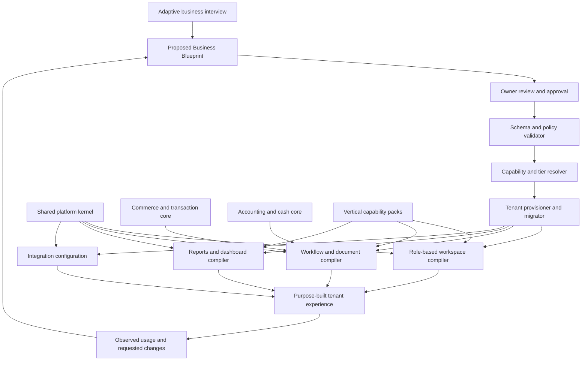

# Adaptive Business OS — Platform Blueprint

**Working name:** Botanium Business OS  
**Status:** Gate 1 closed and Wayfinder map charted; no implementation authorized  
**Research date:** 2026-07-31  
**Canonical purpose:** Product thesis, architecture, scope, and staged delivery plan

## Executive recommendation

Build a **business system compiler**, not another generic AI app builder and not
another separate codebase for every customer.

The product should combine:

- a versioned shared business kernel;
- installable capability packs;
- a structured, adaptive business interview;
- a validated tenant blueprint;
- metadata-driven interfaces, forms, roles, workflows, and reports;
- a deterministic accounting and inventory engine; and
- AI for discovery, explanation, mapping, and assisted customization.

The central rule is:

> AI may propose the business configuration, but governed platform code executes
> it.

The customer receives an experience that looks purpose-built for a clinic,
shop, cafe, restaurant, or travel agency. Underneath, every customer runs the
same maintained platform and compatible module versions. We stop cloning login,
auth, database, backend, frontend, files, accounting, and deployment for each
client.

## Decision state

### Confirmed from Botan's request

- Separate client systems repeatedly need the same technical foundation.
- The business logic and user experience change more than the core platform.
- Small and medium businesses are the initial market.
- Onboarding should interview the owner and adapt the system to the business.
- The resulting forms, interfaces, processes, and visible complexity should be
  tailored to the answers.
- Common needs include auth, data, backend, frontend, cash, AI providers,
  registration, accounting, purchasing, sales, and stock/warehouse.
- The immediate task is planning only.

### Confirmed from prior project evidence

- Identity, roles, permissions, database/API/frontend contracts, and production
  verification recur across client systems.
- Retail/e-commerce work repeatedly needed catalog, purchasing, receiving,
  exact item or batch identity, landed cost, condition and quarantine, stock,
  pricing, media, selling, orders, and evidence-backed readiness.
- Accounting work repeatedly needed source traceability, explicit units and
  currencies, editable FX where relevant, and clear draft/review/submitted
  states.
- Human approval, public verification, and canonical record states must not be
  inferred from generated output or a passing test.
- Clinic work verified patients, visits, treatments, expenses/accounting, and
  roles as real domain needs.
- Prior travel evidence covers a public-facing agency website and service
  taxonomy, not a verified travel back-office implementation.
- Restaurant/cafe operating details in this blueprint are proposed requirements,
  not claims about a previously verified implementation.

### Accepted owner decision — 2026-07-31

- The previously proposed Frappe-first path is rejected.
- The platform must be agentic and intent-first at its foundation, not an ERP
  framework with an agent interface added on top.
- Traditional ERP products may remain research references for business rules,
  but none will be the product runtime, application foundation, or customer
  experience.
- Use Matt Pocock's Wayfinder method with a local Markdown decision tracker in
  this repository.
- Use the following destination for the first map: produce an owner-approved,
  implementation-ready v1 specification and validated executable Reference
  Vertical Slice proving that an Owner Interview can create a Draft Blueprint,
  explicit Blueprint Approval can authorize it, and one Business Kernel can
  provision tailored retail and cafe Sandbox Experiences through Governed
  Configuration. The slice must start locally with one command, execute the
  accepted retail Golden Transaction and cafe order-to-kitchen flow with real
  state transitions, prove stock and balanced-ledger invariants using
  fictitious data, and reset cleanly.
- Install the complete Matt Pocock skills collection, while treating stable,
  in-progress, personal, miscellaneous, and deprecated packages according to
  their recorded maturity rather than assuming every installed skill belongs in
  the project's critical path.
- Define v1 as a two-vertical reuse proof: an Owner Interview produces a
  versioned Business Blueprint and tailored retail and cafe Sandbox Experiences
  from one Business Kernel.
- Require the retail Sandbox Experience to demonstrate the golden transaction:
  purchase → receive → stock → sale → payment → balanced ledger.
- Require the cafe Sandbox Experience to prove order-to-kitchen reuse: Menu
  Item and Modifier → Order → Kitchen Ticket through accepted, preparing, ready,
  and fulfilled → Ingredient Consumption → payment through the shared cash and
  ledger capabilities.
- Exclude tables, reservations, delivery, tips, loyalty, and advanced recipe
  costing from the v1 cafe proof.
- Require the Owner Interview to produce a Draft Blueprint. Only an explicitly
  Approved Blueprint may provision or update a Sandbox Experience.
- Treat Blueprint Approval as acceptance of one specific version. Editing
  creates a new Draft Blueprint version; interview completion, preview viewing,
  and option selection are not approval.
- Require an executable local Reference Vertical Slice that starts with one
  command, runs an Owner Interview, produces and approves a versioned Business
  Blueprint, provisions both Sandbox Experiences, executes the retail and cafe
  flows with real state transitions, demonstrates stock and balanced-ledger
  invariants with fictitious data, and resets cleanly.
- Allow authentication, scaling, backups, billing, external integrations, and
  production hardening to remain simulated or absent from the Reference
  Vertical Slice.
- Limit AI to Governed Configuration within declared Configuration Schemas. AI
  may propose capabilities, fields, forms, layouts, role definitions, workflow
  arrangements, reports, dashboards, explanations, and copy.
- Prohibit AI from inventing arbitrary tenant runtime code, authorization
  enforcement, ledger posting, stock arithmetic, approval truth, destructive
  migrations, or production deployment. The Business Kernel validates and
  executes the Approved Blueprint.
- Keep the Wayfinder effort sandbox-only. Production deployment, real customer
  data, payments, and public release remain outside the authorized boundary.
- Authorize one local initial planning baseline commit and isolated throwaway
  branches for the three unblocked research tickets. Do not push, deploy, or
  begin production implementation.

### Proposed and awaiting approval

- The product model in this document.
- A native intent-first architecture whose contracts and stack are resolved
  through a Wayfinder decision map before implementation.
- Clinic after an explicit privacy, hosting, consent, retention, and compliance
  design.
- Travel after structured discovery with a real agency operator.

## The product thesis

### What it is

An AI-guided platform that converts a business interview into a reviewable
**Business Blueprint**, then assembles a maintained operating system from stable
capabilities.

The blueprint describes:

- the business and locations;
- what it sells;
- how it buys;
- how stock or service capacity is managed;
- how money moves;
- who performs and approves each task;
- which records, screens, and reports each role needs;
- what evidence is required before a state changes;
- which tier and capabilities are suitable; and
- which integrations and localization rules apply.

### What it is not

- A prompt-to-random-code generator.
- A website builder with some database tables.
- A legacy ERP clone or an agent wrapper around one.
- A separate fork for every customer.
- An autonomous accountant.
- An autonomous medical decision-maker.
- A promise that every imaginable workflow can be generated safely.

### The differentiator

Generic builders generate a new app. This platform selects and configures
tested business capabilities.

That distinction enables:

- one security fix to reach every compatible tenant;
- one accounting correction to reach every compatible tenant;
- lower token and development cost;
- stable upgrades instead of customer-specific drift;
- consistent audit and approval behavior;
- vertical experiences without vertical codebase duplication; and
- a clear escape hatch for genuine custom extensions.

## What Hercules teaches us

Hercules is a strong reference for the outer product experience:

- chat-first app creation;
- Build, Plan, and Debug modes;
- Plan-mode interviewing and approval before implementation;
- editable initiatives and testable milestones;
- built-in auth, database, backend, files, hosting, analytics, AI gateway,
  branches, environments, and publishing;
- organization-level skills and teammates;
- separate build-time AI credits and runtime cloud usage; and
- a smooth path from request to hosted result.

Observed in Botan's authenticated billing surface on 2026-07-31:

- Free: $0/month;
- Pro: $25/month;
- Business: $199/month;
- Enterprise: contact sales.

This is a dated account-specific observation. Hercules says the Billing portal
is the canonical plan and price surface.

Hercules is not the whole foundation we need:

- its standard unit is still an independently generated app;
- official documentation does not show a shared accounting, purchasing,
  warehouse, restaurant, clinic, or travel kernel;
- Hercules Commerce does not currently manage physical inventory;
- code, database, and file export is Business-plan gated;
- external self-hosting migration is not supported by Hercules;
- exported backend/auth still requires migration work; and
- Hercules explicitly says it has no plans to support HIPAA.

Conclusion: use Hercules as an experience and workflow benchmark. Do not make it
the canonical runtime for this product.

## Comparable systems and the lessons to keep

| System | Keep | Avoid or fill |
|---|---|---|
| Hercules | Conversational creation, Plan interview, roadmap, preview, one-click publish | Independent generated-app drift; missing domain kernel |
| Odoo/Studio | Broad modular business catalogue and strong restaurant/commerce reference | Complexity, heavy screens, and module breadth before product focus |
| Zoho Creator/Zia | Prompt/document intake, proposed use cases, editable data model, forms, workflows, permissions, approval before generation | Platform dependency and no universal lightweight business ledger |
| Retool/Appsmith | Reusable UI/query modules, governed internal tooling, developer escape hatches | No packaged accounting or vertical operating core |
| Bubble | Blueprint-first generation and customer-facing visual editing | Runtime lock-in and regenerated business logic |

Recommended synthesis:

> Zoho's structured discovery + Hercules' product experience + a native
> agentic runtime + our own governed business kernel.

## Planning method: Wayfinder

Use Matt Pocock's
[Wayfinder skill](https://github.com/mattpocock/skills/blob/main/skills/engineering/wayfinder/SKILL.md)
to develop this product beyond the initial blueprint.

Wayfinder fits because this effort is larger than one agent session and still
contains important fog. It treats planning as a decision system:

- one canonical map names the destination;
- child tickets represent decisions and investigations, not implementation
  slices;
- blocking relationships expose the current frontier;
- research tickets can run agentically;
- prototypes and grilling remain human-in-the-loop;
- unresolved but still-vague areas stay in `Not yet specified`; and
- implementation begins only when the route is clear.

Approved Wayfinder destination:

> Produce an owner-approved, implementation-ready v1 specification and
> validated executable Reference Vertical Slice proving that an Owner Interview
> can create a Draft Blueprint, explicit Blueprint Approval can authorize it,
> and one Business Kernel can provision tailored retail and cafe Sandbox
> Experiences through Governed Configuration. The slice must start locally with
> one command, execute the accepted retail Golden Transaction and cafe
> order-to-kitchen flow with real state transitions, prove stock and
> balanced-ledger invariants using fictitious data, and reset cleanly.

The first decision frontier should cover:

1. the product destination and explicit non-goals;
2. the shared domain language for intents, blueprints, capabilities, records,
   workflows, evidence, approvals, and tenants;
3. the intent-to-blueprint contract;
4. the agent planning, execution, observation, and correction loop;
5. the boundary between deterministic business capabilities and generated
   configuration;
6. tenant isolation, data ownership, portability, and hosting;
7. accounting, cash, and inventory invariants;
8. the adaptive interview and owner-approval experience;
9. the first retail and restaurant pilot boundaries; and
10. the smallest technical prototype that can invalidate the architecture.

The complete Matt Pocock collection was installed locally on 2026-07-31 from
repository commit `2ab958093e83e0ec752e6c1c5932da465bf23e0c`: 41 of 41 skill
packages were verified present. The canonical project route will use only the
appropriate stable subset; in-progress and deprecated packages are installed
for inspection, not silently promoted into the delivery method.

## Conceptual architecture



## The Business Blueprint

The blueprint is the customer-specific source of truth. It should be versioned,
reviewable, exportable, and validated against a formal schema.

Suggested top-level structure:

```yaml
blueprint_version: 1
tenant:
  business_type: retail
  size_profile: small
  countries: [IQ]
  currencies: [IQD]
  languages: [ku, ar, en]
  locations: []
capabilities: []
roles: []
workflows: []
accounting_profile: {}
inventory_profile: {}
documents: []
dashboards: []
integrations: []
evidence_rules: []
ui_preferences: {}
tier: essentials
pack_versions: {}
```

The blueprint should contain configuration, not arbitrary executable code.
Custom code must live in a separately reviewed extension with a stable API.

Every blueprint change should produce:

- a human-readable change summary;
- affected capabilities, records, roles, and reports;
- migrations;
- compatibility checks;
- rollback information;
- test fixtures;
- owner approval state; and
- an audit record.

## Platform layers

### 1. Shared platform kernel

Always present:

- organization, tenant, branch, and location model;
- user registration, login, sessions, MFA-ready auth, and recovery;
- roles, permissions, policy checks, and scoped data access;
- audit log and immutable actor/time/source metadata;
- approval tasks and notifications;
- files, media, document attachments, and retention rules;
- background jobs, schedules, email, SMS/push adapters;
- search, saved views, imports, exports, and printing;
- localization, Arabic/Kurdish/English, RTL, currencies, units, and time zones;
- tenant settings, capability flags, tier entitlements, and versioning;
- integration and webhook framework;
- observability, backups, restore procedures, and health checks; and
- an LLM-provider gateway with cost, privacy, and model policies.

Security, backups, tenant isolation, audit basics, and exportability are platform
requirements. They should not disappear merely because a customer chooses the
small tier.

### 2. Common business transaction core

Reusable across most verticals:

- people and organizations as customers, suppliers, employees, and partners;
- products, services, bundles, variants, units, prices, and taxes;
- quotations, orders, invoices, receipts, payments, refunds, and credits;
- purchasing, receiving, supplier invoices, and payables;
- stock locations, movements, reservations, adjustments, and transfers;
- cash drawers, shifts, bank accounts, and daily close;
- comments, tasks, evidence, attachments, approvals, and state history; and
- operational and financial reports.

The core should model documents and state transitions once. A restaurant order,
retail sale, treatment invoice, and travel booking can reuse the transaction
spine while adding domain-specific records and rules.

### 3. Lightweight accounting core

Use deterministic double-entry underneath and simple language in the small
business interface.

Core rules:

- every posted money event balances;
- draft, approved, posted, reversed, and voided are distinct states;
- posted entries are reversed, not silently edited or deleted;
- source document, actor, date, currency, rate, and evidence remain traceable;
- cash, bank, customer balances, supplier balances, income, expense, tax, and
  owner equity are explicit;
- period and cash-close controls are configurable;
- chart-of-account templates are vertical-aware but versioned;
- foreign exchange assumptions are explicit and editable where allowed; and
- accounting reports trace back to source documents.

The small tier hides journal terminology where possible. The medium tier exposes
receivables, payables, approvals, cost centers, multiple locations, and richer
controls. Both use the same ledger contracts.

### 4. Inventory and costing core

- physical count and accepted receipt are not inferred from a purchase order;
- sellable, reserved, damaged, quarantined, and unavailable are distinct;
- stock movements are append-only business events with corrections;
- exact item, variant, batch/lot, serial, unit, and location are supported;
- landed cost can include supplier cost, transport, duties, and adjustments;
- FIFO is the default for distinct traceable stock;
- moving average is allowed for genuinely interchangeable replenished stock;
- negative stock is blocked by default; and
- inventory value reconciles to the financial ledger when accounting is enabled.

### 5. Vertical capability packs

#### Retail and e-commerce

- catalog, variants, media, labels, and categories;
- suppliers, purchase orders, receiving, landed cost, and quality state;
- warehouse, stock, pricing, promotions, POS, web orders, and returns;
- payment, delivery/courier, cash close, and reconciliation; and
- storefront and publication readiness.

#### Cafe and restaurant

Proposed requirements to validate with an operator:

- menu items, modifiers, recipes, ingredients, yields, and wastage;
- tables, sections, QR ordering, takeaway, delivery, and reservations;
- POS, split bills, discounts, tips/service charges, and cash shifts;
- kitchen display queues, stations, ticket timing, and order status;
- ingredient purchasing, receiving, stock, food cost, and variance; and
- daily sales, cash, wastage, and profitability views.

#### Clinic

- patients, appointments, visits/encounters, services, treatments, and invoices;
- providers, rooms/resources, schedules, packages, expenses, and payments;
- consent, attachments, access logs, retention, and field-level permissions; and
- carefully scoped reminders and administrative AI assistance.

Clinic is not an initial production pilot. It requires a separate legal and
technical decision for data residency, medical privacy, consent, retention,
breach response, backups, and permitted AI use. AI must not diagnose, prescribe,
or silently change clinical records.

#### Travel agency

Proposed requirements to validate with an operator:

- leads, customers, inquiries, quotations, itineraries, and bookings;
- passengers, identity/passport document handling, visas, and expiry reminders;
- suppliers, airlines/hotels/services, vendor cost, selling price, margin, and
  commission;
- deposits, balances, refunds, invoices, and multi-currency;
- tasks, document checklists, communications, and booking status; and
- customer portal and public service/catalog pages.

## Adaptive onboarding interview

The interview is a guided configuration session, not an unrestricted prompt.

### Stage 0 — Safety and scope

- Is this a new system or a replacement?
- Will it contain financial, identity, passport, or medical data?
- Which country, data location, retention, and legal constraints apply?
- What must not be sent to external AI providers?

If the safety profile is unsupported, onboarding stops with a clear explanation.

### Stage 1 — Business shape

- business type and services/products;
- single or multiple locations;
- team size and roles;
- languages, currencies, units, taxes, and operating hours;
- current tools and data sources.

### Stage 2 — Customer and sales journey

- how customers discover, request, book, order, buy, pay, collect, or receive;
- required documents and statuses;
- returns, refunds, cancellations, no-shows, or disputes;
- online, counter, phone, social, and staff-assisted channels.

### Stage 3 — Purchasing, capacity, and stock

Questions branch based on whether the business sells goods, services, time, or a
combination.

- suppliers and purchasing;
- receiving and acceptance;
- physical inventory, recipes, rooms, staff, or time-slot capacity;
- reservations, batches, expiry, condition, and costing.

### Stage 4 — Money and accounting

- cash, bank, card, transfer, credit, deposits, and refunds;
- owner needs: daily cash only, profit view, receivables/payables, or full
  month-end controls;
- currencies, tax, fiscal year, starting balances, approval thresholds; and
- accountant involvement and export needs.

### Stage 5 — People, permissions, and approval

- owner, manager, cashier, purchaser, warehouse, kitchen, clinician, agent,
  accountant, and viewer roles as applicable;
- who creates, approves, posts, refunds, discounts, exports, and deletes drafts;
- separation-of-duty and evidence requirements.

### Stage 6 — Experience and integrations

- device mix and offline expectations;
- dashboard priorities per role;
- branding and density preferences;
- WhatsApp, email, payment, courier, website, ERP, calendar, printer, and other
  integration needs.

### Stage 7 — Blueprint review

Before any tenant is provisioned, show:

- recommended tier;
- selected capabilities and excluded capabilities;
- roles and permission summary;
- customer and internal workflows;
- data model and sensitive fields;
- accounting and inventory behavior;
- reports and dashboards;
- integrations and expected costs;
- assumptions, unsupported requests, and open questions; and
- sample user journeys.

The owner approves or edits this blueprint. Selection alone is not approval.

### Stage 8 — Sandbox and acceptance

- generate only a sandbox with clearly fictitious sample data;
- run golden-path tests for each enabled capability;
- let each role complete its real work;
- remove sample data;
- import starting data through reviewed mappings;
- verify backup and restore;
- obtain owner acceptance; and
- only then authorize production launch.

## Small and medium tiers

Use the same core and data contracts. Tiers change capability, limits, and
visible complexity—not accounting correctness or security fundamentals.

| Area | Essentials / small | Growth / medium |
|---|---|---|
| Locations | One | Multiple |
| Roles | Preset roles | Custom roles and scopes |
| Sales | Standard quote/order/invoice/payment | Approvals, credit, advanced returns |
| Purchasing | Basic purchase and receipt | Approval limits and supplier controls |
| Inventory | One/few locations, simple movements | Warehouses, transfer, batch/lot, valuation controls |
| Accounting UX | Cash/bank, income/expense, simple P&L | AR/AP, cost centers, periods, approval and reconciliation |
| Workflows | Preset | Configurable multi-step workflows |
| Dashboards | Role presets | Custom KPIs and multi-location views |
| Integrations | Standard connectors | Advanced/custom connectors |
| Support | Guided self-service | Assisted onboarding and migration |

Avoid separate "small" and "medium" codebases. Entitlements and blueprint rules
activate a compatible subset of the same platform.

## Tenant and deployment model

### Recommended product contract

- one maintained source tree;
- versioned core and capability packages;
- tenant configuration stored as a blueprint;
- no direct edits to shared core for one customer;
- an explicit extension API for the genuine 20% custom need;
- per-tenant data isolation and export;
- staged migrations with compatibility checks;
- sandbox and production environments; and
- a control plane for tenants, plans, pack versions, health, backups, and usage.

### Recommended technical direction

Build a **native agentic, intent-first runtime**. Do not begin by selecting a
database framework and then attach a chatbot to it.

The first-class platform contracts should be:

- **Intent Brief:** what the owner wants, why, constraints, sensitive-data
  class, and acceptance conditions;
- **Decision Map:** what is decided, unresolved, blocked, or outside the current
  destination;
- **Business Blueprint:** the versioned tenant-specific operating model;
- **Capability Manifest:** which deterministic modules and versions satisfy the
  blueprint;
- **Execution Graph:** planned steps, dependencies, human gates, budgets, and
  rollback boundaries;
- **Evidence Bundle:** observations, tests, source records, and reviewer verdicts
  supporting a state transition; and
- **Change Proposal:** the reviewable diff before a tenant blueprint, schema,
  workflow, or production environment changes.

The runtime then needs two cooperating halves:

1. An agent layer that interviews, researches, maps intent, proposes blueprints,
   plans changes, explains tradeoffs, and observes results.
2. A deterministic capability layer that enforces identity, authorization,
   accounting, inventory, workflow state, audit, migrations, and tenant
   isolation.

The exact implementation stack remains a Wayfinder decision. A useful reference
prototype can use TypeScript, PostgreSQL, JSON Schema, a durable workflow/job
engine, and a React-based interface, but these are testable candidates rather
than an approved production stack.

Hercules may be used to prototype screens or study onboarding. It should not own
the canonical customer data or production runtime in the initial architecture.

## Delivery roadmap

Estimates are intentionally omitted until the Phase 0 spike measures the actual
team, hosting, framework, and migration constraints.

### Phase 0 — Product constitution and architecture spike

Deliver:

- version 1 Business Blueprint schema;
- a Wayfinder map and initial decision frontier;
- a shared domain glossary;
- architecture decision records for intent contracts, agent runtime, tenancy,
  accounting, extension model, AI/data policy, and deployment;
- one tenant provisioned from a checked-in blueprint;
- one role/permission matrix;
- one golden transaction:
  purchase → receive → stock → sell → receive payment → balanced ledger;
- Arabic/RTL proof;
- tenant isolation test;
- backup/export/restore proof; and
- an intent → blueprint → capability → sandbox prototype with no real customer
  data.

Exit only when Botan approves the evidence and stack decision.

### Phase 1 — Shared kernel and retail pilot

Deliver:

- tenant/control-plane basics;
- auth/RBAC/audit/files/jobs/localization;
- parties, catalog, purchasing, inventory, sales, cash, and ledger;
- metadata-driven forms, lists, workflows, and reports;
- guided onboarding for a constrained retail profile; and
- one sandbox retail tenant completing end-to-end acceptance tests.

### Phase 2 — Cafe/restaurant proof of reuse

Deliver:

- restaurant interview branches;
- menu/recipe/ingredient model;
- table/POS/order/kitchen states;
- shift/cash close and food-cost flows; and
- a second tenant created without forking the platform.

The key test is not just whether the restaurant works. It is whether shared
fixes and upgrades still apply cleanly to both retail and restaurant tenants.

### Phase 3 — Self-service assembly and tiers

Deliver:

- blueprint review UI;
- entitlement/tier engine;
- sandbox generation;
- import/mapping assistant;
- guided acceptance and launch checklist;
- plan/billing/usage controls; and
- supported extension workflow.

### Phase 4 — Travel discovery and capability pack

Run operator discovery first. Build only after validating booking, supplier,
document, multi-currency, margin, commission, cancellation, and refund flows.

### Phase 5 — Clinic readiness and capability pack

Proceed only after privacy/compliance architecture, data residency, consent,
retention, access logging, backup/restore, incident response, and AI policy are
approved. Start with administrative workflows before sensitive clinical depth.

## Golden tests and invariants

Every enabled pack must pass:

- tenant isolation;
- denied-by-default authorization;
- super-admin and owner contracts;
- role-specific navigation and data visibility;
- balanced ledger for every posted money event;
- stock cannot become sellable without an accepted movement;
- posted records cannot be silently altered;
- reversal and refund correctness;
- approval state is explicit;
- imports are previewed and reversible before commit;
- sample data is marked and removable;
- backup, restore, and export;
- capability-pack upgrade and rollback;
- Arabic/RTL and currency/unit formatting;
- browser tests for the core user journeys; and
- public/customer-facing verification where a public surface exists.

## AI architecture and guardrails

Use AI for:

- adaptive interviewing;
- turning free text and documents into proposed structured answers;
- identifying missing requirements and contradictions;
- explaining workflows in the customer's language;
- drafting blueprint changes;
- mapping imports;
- suggesting reports and interface arrangements; and
- low-risk assistance inside enabled modules.

Do not use AI as the system of record or deterministic engine for:

- authorization;
- ledger posting;
- inventory quantity;
- pricing approval;
- tax calculation;
- medical diagnosis or prescription;
- destructive migrations; or
- production deployment approval.

Every model call should carry:

- tenant and purpose classification;
- allowed data classes;
- selected provider/model;
- redaction policy;
- budget and latency ceiling;
- prompt/template version;
- trace and outcome status; and
- a clear fallback when AI is unavailable.

Support a provider abstraction, but begin with a small approved model set rather
than every provider.

## Risks and controls

| Risk | Control |
|---|---|
| Scope becomes "build every ERP" | Constrained capabilities, explicit non-goals, two pilot profiles |
| Every customer still becomes a fork | Blueprint configuration plus versioned packs; extension API only |
| AI produces inconsistent systems | JSON-schema output, deterministic validation/compiler, golden tests |
| Accounting mistakes damage trust | One deterministic ledger, invariants, reversals, expert review |
| Custom UX drifts from backend | Generated contracts and end-to-end role tests |
| Platform becomes ordinary CRUD behind a chatbot | Make intent, blueprint, execution graph, evidence, and approval first-class contracts |
| Tenant data leak | Isolation tests, scoped policies, audit, secrets separation |
| Clinic creates regulatory exposure | Defer production clinic pack until approved compliance design |
| Tiering weakens security | Security/isolation/audit baseline in every tier |
| Upgrades break customized tenants | Blueprint/pack compatibility matrix, staged migrations, rollback |

## Success measures

Targets should be baselined during Phase 0, then tracked:

- time and AI cost from interview to accepted sandbox;
- percentage of features supplied by shared capabilities;
- number of tenant-specific code forks, with a target of zero;
- time for a shared fix to reach compatible tenants;
- blueprint validation and migration success;
- tenant isolation and authorization failures;
- unbalanced journal attempts, which must never post;
- inventory invariant failures, which must never silently post;
- task completion by real business roles;
- support requests per tenant; and
- owner acceptance and retained usage.

## Immediate next decision

The canonical local Wayfinder map owns the current decision frontier. The first
three research notes were reviewed and integrated as evidence without selecting
a stack or authorizing implementation. Work the frontier one claimed decision
ticket at a time and keep full resolutions in their child tickets.

No implementation, deployment, customer data import, or production change
should begin until the decision map produces an owner-approved specification
and Botan explicitly authorizes the build phase.

## Research sources

### Hercules

- [Welcome](https://hercules.app/docs/welcome)
- [Quickstart](https://hercules.app/docs/apps/quickstart)
- [Agent modes](https://hercules.app/docs/ai/agent-modes)
- [Roadmap](https://hercules.app/docs/apps/roadmap)
- [Database](https://hercules.app/docs/apps/database)
- [AI Gateway](https://hercules.app/docs/apps/ai-gateway)
- [Commerce products and inventory limitation](https://hercules.app/docs/apps/commerce/products-features)
- [Export data](https://hercules.app/docs/platform/export-data)
- [Enterprise and HIPAA position](https://hercules.app/docs/platform/enterprise)

### Comparable platforms and planning methods

- [Matt Pocock's skills repository](https://github.com/mattpocock/skills)
- [Wayfinder](https://github.com/mattpocock/skills/blob/main/skills/engineering/wayfinder/SKILL.md)
- [Zoho Creator Zia App Builder](https://help.zoho.com/portal/en/kb/creator/developer-guide/creating-applications/create-applications/articles/creating-applications-with-zia-app-builder)
- [Odoo Studio](https://www.odoo.com/documentation/18.0/applications/studio.html)
- [Odoo restaurant POS](https://www.odoo.com/documentation/19.0/applications/sales/point_of_sale/restaurant.html)
- [Retool AI app generation](https://retool.com/ai-app-generation)
- [Appsmith](https://www.appsmith.com/)
- [Bubble AI app generator](https://manual.bubble.io/beta-features/bubbles-ai-app-generator)
