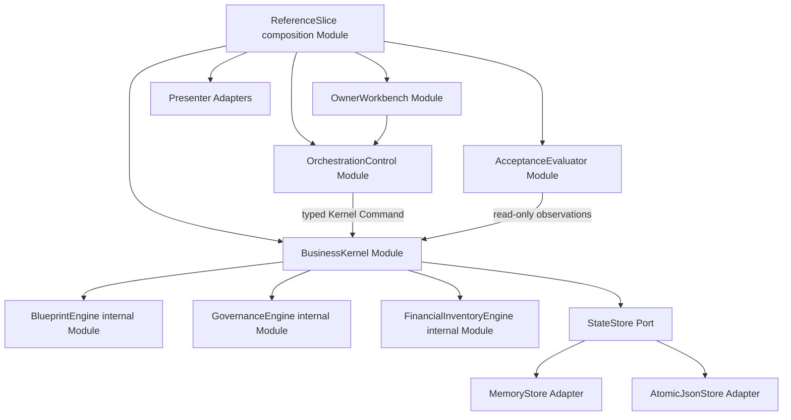

# ADR 0001: Dependency-light modular monolith for the Reference Vertical Slice

- **Status:** Accepted
- **Date:** 2026-08-02
- **Scope:** Local, fictitious Adaptive Business OS v1 Reference Vertical Slice
- **Decision owner:** Botan, through standing approval of the recommended
  option for the remaining Wayfinder tickets
- **Wayfinder ticket:** [Select the v1 reference architecture](../../.scratch/adaptive-business-os-v1/issues/13-select-reference-architecture.md)

## Context

The Reference Vertical Slice must start with one local command, preserve exact
Blueprint and command authority boundaries, execute retail and cafe through one
Business Kernel, expose real state transitions and independently recomputable
stock and ledger results, and reset both fictitious targets cleanly.

It must also remain honest about what it does not prove. Production
authentication, concurrent multi-process writes, scaling, backups, billing,
external integrations, provider AI, deployment, and production hardening are
out of scope. Introducing those systems now would test framework integration
rather than the accepted business contracts.

The choice is hard to reverse once persistence shapes, framework lifecycle,
and public test seams spread across the slice. It is also surprising because a
full web framework, database ORM, and agent runtime are intentionally deferred.
The trade-off is between immediate production resemblance and a small,
deterministic proof whose boundaries can be inspected end to end.

## Decision

Build the Reference Vertical Slice as one dependency-light Node.js modular
monolith with deep domain modules and replaceable boundary adapters.

### Local stack profile

- Node.js `v26.5.0` on Darwin arm64 is the runtime actually validated by the
  accepted slice evidence. The dependency-light package declares the supported
  local range `>=22.18 <27` and records the exact runtime in every report.
- Use ECMAScript modules and JSDoc type contracts so the slice runs directly
  without a transpiler. Production-grade TypeScript compilation remains a
  later implementation decision, not a prerequisite for this proof.
- Use npm scripts as the single task runner.
- Use `node:test` and `node:assert/strict` for behavior tests through approved
  public Interfaces.
- Use project-owned canonical JSON routines plus Node built-ins for SHA-256
  identities, local HTTP when needed, filesystem persistence, and terminal or
  static-HTML evidence.
- Use one single-writer, atomically replaced local JSON state file for the
  runnable slice and an in-memory Store Adapter for tests. The file is a local
  durability aid, not a production database.
- Bind any local server to `127.0.0.1`; external network access is absent.
- Use deterministic fictitious fixtures. The slice has no external model,
  payment, email, storage, auth, or deployment Adapter.

### Module structure



The named Modules are behavioral boundaries, not directory names or business
Capabilities:

1. **OwnerWorkbench Module** owns the eight-family Owner Interview projection,
   attributable Intent Brief updates, one-question interaction model,
   owner-facing Intent Brief review, and explicit Human Gate subject. It
   proposes; it never derives Blueprint validation truth, creates approval, or
   creates business truth.
2. **OrchestrationControl Module** owns Orchestration Run state, Control Phase,
   Wait Reason, Human Gates, Run Budget, immutable task and failure references,
   command correlation, resume checks, and Completion Conditions. It submits
   exact commands and observes results; it never executes them.
3. **BusinessKernel Module** is the sole governed executor. Behind its small
   Interface it owns Blueprint validation and authority, command idempotency,
   Role and Workflow enforcement, Evidence duties, immutable business effects,
   stock and ledger algorithms, target provisioning, Applied Blueprint state,
   and Sandbox Reset.
4. **BlueprintEngine** is an internal pure Module behind BusinessKernel. It
   derives normalized Blueprint content and Content Identity, validates closed
   configuration, produces immutable Draft Review Material including
   traceability, coverage, and Semantic Diffs, and compiles exactly one
   target-neutral Effective Blueprint when a later authorized path requires
   compilation. It is not independently callable by UI or orchestration.
5. **GovernanceEngine** and **FinancialInventoryEngine** are internal deep
   Modules selected by governed-action identity. They hide state-transition,
   causation, authorization, posting, stock, reconciliation, and reversal
   mechanics. They never branch on vertical labels.
6. **AcceptanceEvaluator Module** reads exact durable results and independently
   evaluates the later Ticket 14 conditions. It creates Observation and slice
   evidence only; it cannot mutate Kernel state.
7. **ReferenceSlice composition Module** wires Modules and Adapters, exposes the
   one-command scenario runner, composes owner-facing Draft review views from
   read-only BusinessKernel observations, and owns no business rule.

### Draft review material ownership clarification

On 2026-08-10, the decision owner clarified the Ticket 03 ownership split
without adding a public Interface:

- BlueprintEngine privately derives one immutable Draft Blueprint and its
  normalized Blueprint, Content Identity, Configuration Validation Report,
  Intent Traceability, Acceptance Condition coverage, data-exposure and intent
  disposition summaries, and schema-aware Semantic Diff.
- BusinessKernel remains the sole mutation authority. Its accepted Draft
  creation transaction stores the exact immutable Draft and derived Draft
  Review Material together, and `BusinessKernel.observe` may return a defensive
  read-only projection of that exact stored pair.
- ReferenceSlice composes the owner-facing `DraftBlueprintReview` view from the
  read-only observation. Presentation does not recalculate validation, diffing,
  traceability, Content Identity, approval, or execution truth.
- OwnerWorkbench continues to own Owner Interview and Intent Brief review. It
  does not store, validate, canonicalize, or authorize a Business Blueprint.

This clarification keeps Blueprint behavior behind the existing deep private
Module and preserves `ReferenceSlice.dispatch` and `BusinessKernel.observe` as
the accepted Ticket 03 public test seams.

### Public Interfaces and seams

The reference implementation exposes only these high-level Interfaces:

```text
ReferenceSlice.dispatch(OwnerOrControlAction) -> ReferenceSliceView
BusinessKernel.submit(KernelCommand)          -> KernelCommandResult
BusinessKernel.observe(KernelQuery)           -> KernelObservation
AcceptanceEvaluator.evaluate(EvidenceInput)   -> AcceptanceReport
```

- `ReferenceSlice.dispatch` is the owner-visible and end-to-end test seam.
- `BusinessKernel.submit` is the sole mutation seam and the focused business
  behavior test seam.
- `BusinessKernel.observe` is the read-only invariant and evidence seam.
- `AcceptanceEvaluator.evaluate` is the final fail-closed acceptance seam.
- `StateStore.transact(expectedRevision, operation)` is an internal Port. Its
  MemoryStore and AtomicJsonStore Adapters make the seam real without exposing
  persistence through the public Kernel Interface.
- Clock and opaque-identity generation are injected internal Ports with system
  and deterministic-fixture Adapters because time and identity are true test
  boundaries.
- Presenters consume view models. Terminal, JSON, and optional static-HTML
  Presenter Adapters contain no authority and do not become separate APIs.

Tests assert observable outcomes only through these Interfaces. They do not
mock internal Modules, inspect private state, or treat a file format as a
public contract.

### State and atomicity

The AtomicJsonStore serializes one complete local state envelope containing a
monotonic revision, governance records, two target generations, immutable
command results, and derived-evidence inputs. A command transaction:

1. loads one exact revision;
2. validates the complete typed command and expected baseline;
3. produces all Records, Business Events, Evidence references, Stock
   Movements, Posting Sets, and command result in memory;
4. recomputes invariants;
5. rejects without replacing the state file if any check fails; and
6. writes a complete temporary file and atomically renames it only when all
   effects pass.

This gives the single-process local proof an inspectable all-or-nothing seam.
It does not claim distributed transactions, crash-safe database durability,
multi-writer concurrency, or backup safety.

### Capability and Adapter packaging

The slice statically links Kernel Foundation, the eleven Capabilities, declared
Policy Profiles, and local Adapters into one package. Each independently
governed contract still has its project-owned Machine Identity, exact `1.0.0`
version, Configuration Schema, immutable manifest, content identity, and
directional compatibility entries in the registry.

Static registration is deliberate: there is no dynamic plugin loader,
tenant-installed package, arbitrary endpoint, or runtime extension. Splitting
Capabilities into separately published packages later may change packaging but
may not change their identities, semantics, or compatibility without normal
versioned Kernel release discipline.

### One-command boundary

`npm run reference-slice` is the only required run command. It creates a fresh
local run directory, uses one approved fictitious Owner Interview fixture,
records the explicit owner decisions and exact Blueprint Approval command,
provisions both targets, executes both accepted business scenarios, evaluates
every invariant and negative path, writes owner-reviewable JSON and static-HTML
evidence, resets both targets, rechecks the clean boundary, and exits nonzero on
any Required failure.

An optional local review mode may render the accepted Guided cockpit, Evidence
workbook, and target views from the same view models. It cannot be required for
machine-verifiable acceptance and cannot mutate state outside
`ReferenceSlice.dispatch` and `BusinessKernel.submit`.

## Alternatives considered

### Full TypeScript web stack with React, an ORM, and SQLite

This looks closer to a customer application and provides mature UI and schema
tooling. It was rejected for the Reference Vertical Slice because bundling,
framework state, ORM behavior, migrations, and third-party version choices
would dominate a proof whose hard questions are authority, state, stock,
ledger, and reset. A later product implementation may adopt parts of this
stack behind the accepted Interfaces.

### Python agent framework plus API service

This aligns with several agent-runtime ecosystems. It was rejected because the
v1 slice does not require a live model provider, and giving an agent framework
the process center would obscure the accepted three-layer authority boundary.
Python remains a possible future Agent Run Adapter, never the Business Kernel
authority by default.

### Event broker, workflow engine, and separate services

This offers production-style durability and scaling. It was rejected because
the local proof has one writer, no external integration, and no production
availability requirement. Distributed services would create replay,
deployment, and operational questions that the slice is explicitly not meant
to answer.

## Consequences

### Positive

- One command and no dependency installation beyond the validated Node runtime.
- Every authority boundary and state transition remains inspectable.
- Deterministic tests can exercise deep Modules through small public Interfaces.
- Memory and file Adapters prove a real persistence seam without an ORM.
- The same action registry and exact Capability identities serve both targets.
- A future database, web UI, provider AI, or durable orchestrator can be added
  as an Adapter or deliberate Module change rather than embedded in business
  configuration.

### Negative and explicit limits

- The local JSON Store is single-process and not a production datastore.
- Browser-native presentation will be less polished than a full application
  framework.
- JSDoc contracts do not provide the full static guarantees of a production
  TypeScript build.
- Durable orchestration is modeled and persisted locally, not proven under a
  distributed workflow engine.
- Production adapter selection, database schema, authentication, deployment,
  backup, observability, and operations require later ADRs and cannot inherit
  acceptance from this slice.

These limits are acceptable because the Reference Vertical Slice is a tested
architecture and contract proof, not a production alpha.
