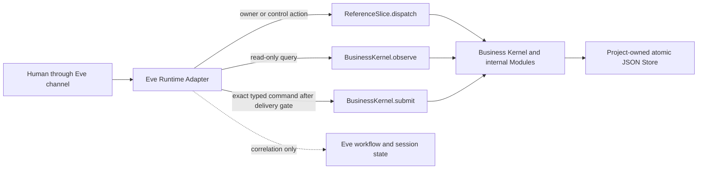

# ADR 0002: Eve as a removable agent-runtime Adapter

- **Status:** Accepted
- **Date:** 2026-08-02
- **Scope:** Local, fictitious Adaptive Business OS v1 Reference Vertical Slice
- **Decision owner:** Botan
- **Amends:** [ADR 0001](./0001-reference-slice-modular-monolith.md)

## Context

ADR 0001 deliberately kept an agent framework outside the Business Kernel so
the Reference Vertical Slice could prove authority, stock, ledger, and reset
contracts without confusing model output with business truth. The Owner
Interview now needs a durable agent-facing delivery layer, human-in-the-loop
transport, and integration evals. Eve provides those facilities, but its
preview release and permissive default tools require an explicit containment
boundary.

The accepted domain contract is unchanged: an Agent Run may interview, plan,
explain, and propose; an Orchestration Run may persist control state; only the
Business Kernel may validate a Kernel Command and create governed truth.

## Decision

Adopt Eve `0.29.5` as a replaceable outer **Eve Runtime Adapter**. Pin its
direct runtime companions `ai` at `7.0.48` and `zod` at `4.4.3`. Eve requires
Node.js 24 or newer, so this ADR narrows the local package range from
`>=22.18 <27` to `>=24 <27`; Node.js 24 is the minimum supported runtime and
the previously validated Node.js 26 remains supported.

Eve may:

- conduct the Guided Cockpit and Owner Interview through
  `ReferenceSlice.dispatch`;
- read the explicit empty-state authority projection through
  `BusinessKernel.observe`;
- transport a human decision about whether to submit one unchanged proposed
  Kernel Command;
- submit that exact typed command through `BusinessKernel.submit` after the
  transport gate is satisfied;
- preserve agent-session correlation, pause and resume delivery, traces, and
  local integration-eval evidence; and
- expose a local HTTP delivery surface for the deterministic spike.

Eve may not:

- replace `ReferenceSlice.dispatch`, `BusinessKernel.submit`,
  `BusinessKernel.observe`, or `AcceptanceEvaluator.evaluate`;
- store or create Blueprint Approval, a Human Gate Decision, a Business Event,
  a Record transition, Evidence, a Stock Movement, a Ledger Entry, an Applied
  Blueprint, or Sandbox Reset truth;
- treat an Eve session, turn, tool call, input request, approval response,
  replay result, or trace as one of the project's governed identities or
  records;
- construct arbitrary Kernel Commands from free text, bypass Kernel
  validation, or convert model output into execution authority; or
- connect to provider models, external services, production systems, or real
  business data in the Reference Vertical Slice.

Eve's tool approval is a delivery gate only. It may authorize invocation of
one unchanged Adapter tool call, but it is not a project Human Gate Decision,
Blueprint Approval, Role authorization, or Kernel authority. A later ticket
must construct the typed project Human Gate Decision and bind it into a Kernel
Command before any governed command that requires one can be accepted.

## Adapter shape

- Project business and governance state remains in the existing Store Adapter,
  outside Eve workflow/session state.
- Eve session and turn identities are correlation identities only.
- The Adapter scopes its local state file by a validated Eve session identity;
  it never exposes the raw Store or its persistence format.
- The deterministic spike uses `mockModel` and fictitious inputs. No provider
  credential or external network call is needed.
- All default shell, filesystem, web, delegation, task-list, and free-form
  question tools are disabled. Only project-authored, closed-schema Adapter
  tools are visible to the fixture model.
- `.eve/` contains derived local workflow and eval artifacts and is not tracked.

## Testing and replacement boundary

The existing `node:test` suite remains the authoritative behavior-contract
suite and imports no Eve code. Eve evals exercise the actual local Eve HTTP
surface and prove only Adapter wiring, tool containment, pause/resume delivery,
and replay-safe Kernel submission. They are not a fifth business-authority
seam and do not establish Reference Vertical Slice acceptance.

Removing or replacing Eve must require changes only under `agent/`, `evals/`,
package/runtime wiring, and this delivery ADR. No Business Kernel or accepted
public-interface test may need to change.

## Consequences

### Positive

- We gain durable agent delivery and human-in-the-loop transport without
  relocating business authority.
- The Owner Interview can become agentic while retaining deterministic public
  seams and local persistence.
- A provider-free fixture can test the integration repeatably.
- Eve remains removable because the core implementation does not import it.

### Costs and limits

- Eve is a preview dependency and must remain isolated behind the Adapter.
- Node.js 22 is no longer a supported runtime for this package.
- Eve's native limits cover only part of the accepted Run Budget; the
  project-owned OrchestrationControl Module must still enforce the complete
  ten-dimension budget contract.
- Eve approval transport does not complete the later Human Gate, Blueprint,
  provisioning, financial, stock, reset, or final acceptance tickets.
- Deployment, production auth, production persistence, provider AI, and real
  data remain out of scope.
