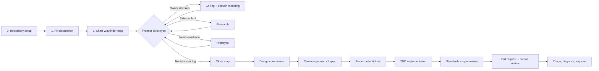

# Adaptive Business OS — Matt Pocock Skill Journey

**Status:** Gates 0–2 completed; decision resolution has not started  
**Destination:** Produce an owner-approved, implementation-ready v1
specification and validated executable Reference Vertical Slice proving that an
Owner Interview can create a Draft Blueprint, explicit Blueprint Approval can
authorize it, and one Business Kernel can provision tailored retail and cafe
Sandbox Experiences through Governed Configuration. The slice must start
locally with one command, execute the accepted retail Golden Transaction and
cafe order-to-kitchen flow with real state transitions, prove stock and
balanced-ledger invariants using fictitious data, and reset cleanly.  
**Installed source:** [`mattpocock/skills`](https://github.com/mattpocock/skills)
at commit `2ab958093e83e0ec752e6c1c5932da465bf23e0c`  
**Installation evidence:** 41 of 41 skill packages verified present on
2026-07-31.

## Purpose and source-of-truth boundary

This document is the stable **method roadmap**: which skill to use, in what
order, what it produces, and what must be true before moving forward.

It is not the live project decision tracker. After setup and destination
grilling, the canonical Wayfinder state will live at:

- `.scratch/adaptive-business-os-v1/map.md`
- `.scratch/adaptive-business-os-v1/issues/NN-<decision-name>.md`

The Wayfinder map alone will own the current frontier, claims, blockers,
resolved decisions, fog, and scope. This journey may link to those artifacts but
must not duplicate their live state.

## Operating rule

Use **one primary skill and one exit gate at a time**. Companion skills may run
only when the primary skill calls for them.

Wayfinder is the planning orchestrator, but it does not precede all discussion.
Its own charting process invokes `grilling` and `domain-modeling` to fix the
destination and discover the initial frontier.

## Step-by-step gated journey

### Gate 0 — Configure the repository

**Primary skill:** `setup-matt-pocock-skills`

**Already decided**

- Local Markdown issue tracker.
- Single repository with no remote.
- Single-context domain-document layout.

**Still requires owner choices**

- Keep or replace the five default triage labels.
- Create `AGENTS.md` or `CLAUDE.md` as the repository instruction file.

**Durable output**

- `docs/agents/issue-tracker.md`
- `docs/agents/domain.md`
- `docs/agents/triage-labels.md`
- an `## Agent skills` block in the chosen root instruction file

**Exit gate:** The tracker, triage vocabulary, and domain-document conventions
are explicit and owner-approved.

**Do not start yet:** Wayfinder map files, product specification, stack
selection, or code.

### Gate 1 — Fix the destination and non-goals

**Primary skill:** `wayfinder` in chart mode  
**Required companions:** `grilling` and `domain-modeling`  
**Convenient repository-aware wrapper:** `grill-with-docs`

Work one question at a time. Botan answers owner decisions; the agent looks up
discoverable facts instead of asking Botan to supply them. As terms crystallize,
write only domain language to `CONTEXT.md`. Offer an ADR only for a decision
that is hard to reverse, surprising without context, and based on a real
trade-off.

**Durable output**

- approved Destination wording;
- explicit non-goals and scope boundary;
- initial canonical terms in `CONTEXT.md`; and
- selective ADRs only when all ADR criteria are met.

**Exit gate:** Botan confirms that the destination describes what “done” means
for this effort.

**Do not start yet:** Architecture implementation, production stack selection,
or treating proposed blueprint content as approved fact.

### Gate 2 — Chart the decision system

**Primary skill:** `wayfinder`

Create the canonical local map, precise child decision tickets, and blocking
edges. Chart breadth-first. A sharp question becomes a ticket; a suspected but
still-unphraseable area remains under `Not yet specified`.

The map Notes should explicitly allow only the execution needed for decision
prototypes and one validated reference prototype. Production implementation,
deployment, and customer data remain outside this map until the v1 spec is
approved.

**Durable output**

- `.scratch/adaptive-business-os-v1/map.md`;
- one child file per precise decision question;
- blocking and claim metadata; and
- fog and out-of-scope sections.

**Exit gate:** The map exposes a real frontier of open, unblocked, unclaimed
decision tickets.

**Do not start yet:** Resolving tickets during charting or creating
implementation tickets.

### Gate 3 — Resolve owner and product decisions

**Primary skill:** `wayfinder` in work mode  
**Decision method:** `grilling` + `domain-modeling`  
**Preferred wrapper:** `grill-with-docs`

Claim one frontier ticket before work. Ask one question at a time, always with a
recommended answer. Resolve at most one human-in-the-loop decision ticket per
session. Record the answer in the child ticket, mark it resolved, then add only
a linked one-line gist to the map.

**Exit gate:** Botan explicitly accepts the ticket resolution and any newly
clarified fog has been converted into precise tickets where appropriate.

**Do not start yet:** Answering Botan's side of a decision, batching many owner
decisions, or writing production code.

### Gate 4 — Resolve external facts

**Primary skill:** `research` under a Wayfinder research ticket

Delegate the sharp research question to a background agent. Require primary
sources—official documentation, specifications, source code, or first-party
APIs—and save one cited Markdown research note in the repository.

**Exit gate:** The cited evidence is sufficient for the blocked decision to
proceed.

**Do not start yet:** Choosing architecture from popularity or relying only on
secondary summaries.

### Gate 5 — Test uncertain behavior and experience

**Primary skill:** `prototype` under a Wayfinder prototype ticket  
**Continuity support:** `handoff`

Use a logic prototype for state-machine questions and a UI prototype for
appearance or interaction questions. The artifact is deliberately throwaway,
clearly marked, starts with one command, keeps state visible, and records the
verdict it produced.

The approved destination's “tested prototype” means a **validated throwaway
prototype rehearsed against explicit acceptance scenarios with a recorded
verdict**. It does not mean production-grade automated testing. TDD begins only
after the specification and implementation tickets are approved.

For v1, that prototype is the **Reference Vertical Slice**: it starts locally
with one command, spans Owner Interview → Blueprint Approval → both Sandbox
Experiences, executes the accepted retail and cafe flows with real state
transitions, proves stock and balanced-ledger invariants with fictitious data,
and resets cleanly. Production hardening and external services remain outside
this prototype.

**Exit gate:** The prototype answers its exact question through observed
behavior and Botan accepts the verdict.

**Do not start yet:** Production persistence, polishing, abstraction, or merging
prototype code into the main branch.

### Gate 6 — Design the core seams

**Primary skill:** `codebase-design`  
**Companion:** `domain-modeling`  
**Tracker context:** one claimed Wayfinder decision ticket

Define deep modules, small public interfaces, adapters, and test seams using the
resolved domain language, invariants, and prototype evidence.

**Exit gate:** Botan approves where behavior lives, which seams are public, and
which seams production tests will exercise.

**Do not start yet:** Speculative interfaces, one-implementation abstractions,
or organizing the system around files before behavior is understood.

### Gate 7 — Close the Wayfinder map

**Primary skill:** `wayfinder`

Close only when there are no open decision tickets and no remaining in-scope
fog. The map indexes decisions by ticket name and link; the full resolution
continues to live only in its child ticket.

**Exit gate:** The route to the destination is clear and Botan explicitly
approves map closure.

**Do not start yet:** Implementation merely because one route looks promising.

### Gate 8 — Synthesize the v1 specification

**Primary skill:** `to-spec`

Synthesize—not re-interview—the closed map, `CONTEXT.md`, ADRs, cited research,
prototype verdicts, invariants, interfaces, exclusions, user stories, and
testing decisions into:

- `.scratch/adaptive-business-os-v1/spec.md`

**Exit gate:** Botan approves the complete v1 specification and its high-level
public test seams.

**Do not start yet:** Implementation tickets or code.

### Gate 9 — Create tracer-bullet implementation tickets

**Primary skill:** `to-tickets`

Create one local Markdown file per independently demonstrable vertical slice,
including blocking edges, acceptance criteria, and relevant spec context.

**Exit gate:** Botan approves ticket granularity, dependencies, and acceptance
criteria.

**Do not start yet:** Horizontal tickets such as “all database work,” then “all
API work,” then “all frontend work,” or any unapproved implementation.

### Gate 10 — Establish coding feedback

**Primary skill:** `setup-pre-commit` only if the selected stack is compatible
JavaScript/TypeScript  
**Conditional architecture skill:** `setup-ts-deep-modules` only if TypeScript
is selected and its in-progress status is explicitly accepted

Set up tooling only after the actual package manager, checks, and stack exist.

**Exit gate:** The hook is executable and formatting, type checking, and tests
pass through the real project commands.

### Gate 11 — Implement one unblocked ticket

**Primary skill:** `implement`  
**Required implementation discipline:** `tdd`  
**Domain inputs:** `CONTEXT.md`, relevant ADRs, and the approved ticket

Before the first test, confirm the public seam with Botan. Work in vertical
red → green slices: one failing behavior test, the smallest implementation that
passes, then the next behavior. Refactoring waits for review.

**Exit gate:** Acceptance criteria pass through public behavior, focused checks
pass throughout, and the full suite passes at the end.

**Do not start yet:** Tests at unapproved seams, bulk tests followed by bulk
implementation, speculative scope, or implementation-coupled mocks.

### Gate 12 — Review before a pull request

**Primary skill:** `code-review`

Review from a fixed comparison point on two separate axes:

1. **Standards:** compliance with the repository's documented standards.
2. **Spec:** fidelity to the originating approved ticket and specification.

**Exit gate:** Both review tracks have no unresolved blocking findings and the
full suite remains green.

**Do not start yet:** A PR or merge while review blockers remain.

### Gate 13 — Create and hand off the pull request

**Primary workflow:** Git and GitHub  
**Continuity skill:** `handoff` only when another session or agent must continue

Create a focused PR linking its specification and ticket, test evidence, known
limitations, and review outcome. A handoff is temporary context, not a duplicate
source of truth.

**Exit gate:** CI is green and human review/acceptance is explicit.

**Never infer:** Human approval, merge authorization, or production readiness.

### Gate 14 — Operate and improve from evidence

Use these only when their trigger exists:

- `triage` for incoming issues and external PRs;
- `diagnosing-bugs` for broken, failing, or slow behavior with a reproducible
  feedback loop;
- `improve-codebase-architecture` after real code exposes actual hot spots;
- `resolving-merge-conflicts` during an active merge or rebase conflict; and
- `handoff` when continuity crosses a context boundary.

## Provisional Wayfinder decision horizon

These are candidate questions derived from the current blueprint. They are not
canonical tickets until destination and breadth-first grilling confirms that
each question is sharp enough.

1. Define v1 acceptance and explicit non-goals.
2. Establish the ubiquitous language for Intent Brief, Business Blueprint,
   Capability Manifest, Execution Graph, Evidence Bundle, Change Proposal,
   Tenant, Capability, Workflow, Approval, and Record.
3. Decide the adaptive interview and intent-to-blueprint contract.
4. Decide Business Blueprint schema, versioning, approval, and change semantics.
5. Decide the shared-kernel versus capability-pack boundary.
6. Lock deterministic authorization, accounting, cash, inventory, audit, and
   tenant-isolation invariants.
7. Decide the agent planning, execution, observation, correction, and human-gate
   loop.
8. Decide data ownership, portability, hosting, backup/restore, AI-provider, and
   sensitive-data policies.
9. Validate the first retail golden flow and restaurant reuse test.
10. Research candidate intent-first technical approaches from primary sources.
11. Prototype intent → blueprint → capability → sandbox logic.
12. Prototype interview → blueprint review → owner approval experience.
13. Select deep-module interfaces and public test seams.
14. Make the stack decision and record only the warranted ADRs.
15. Validate spec readiness and close the map.

## Disposition of all 41 installed skills

Installation does not make every package a project dependency. The following
classification keeps the full collection available without weakening the
governed path.

### Critical path — 14

| Skill | Project use |
|---|---|
| `setup-matt-pocock-skills` | One-time repository configuration |
| `wayfinder` | Canonical decision-map orchestrator |
| `grilling` | One-question-at-a-time owner decisions |
| `domain-modeling` | Living domain glossary and selective ADR discipline |
| `grill-with-docs` | Repository-aware wrapper around grilling and domain modeling |
| `research` | Primary-source evidence for research tickets |
| `prototype` | Throwaway logic or UI evidence for uncertain decisions |
| `handoff` | Context continuity across sessions without replacing canonical files |
| `codebase-design` | Deep modules, interfaces, adapters, and public seams |
| `to-spec` | Closed decision map to approved v1 specification |
| `to-tickets` | Specification to vertical tracer-bullet tickets |
| `implement` | Execute one approved ticket |
| `tdd` | Red → green behavior development at approved seams |
| `code-review` | Separate standards and specification reviews before PR |

### Conditional support — 10

| Skill | Use only when |
|---|---|
| `ask-matt` | The correct collection workflow is unclear; it is a router, not a project stage |
| `diagnosing-bugs` | Behavior is observably broken, failing, or slow |
| `improve-codebase-architecture` | Working code reveals real architectural hot spots |
| `resolving-merge-conflicts` | A merge or rebase conflict is active |
| `triage` | Incoming issues or external PRs become a real request surface |
| `setup-pre-commit` | A compatible JS/TS repository and real project checks exist |
| `setup-ts-deep-modules` | TypeScript is selected and its in-progress maturity is accepted |
| `to-questionnaire` | A restaurant, clinic, accounting, legal, or travel expert must answer a decision set asynchronously |
| `wizard` | A confirmed provider, deployment, or migration procedure needs a human-guided setup tool |
| `writing-great-skills` | The platform begins creating or maintaining its own reusable agent skills |

### Installed but excluded from the primary project path — 17

| Skill | Reason |
|---|---|
| `grill-me` | Duplicates the interview without maintaining repository domain docs; prefer `grill-with-docs` |
| `teach` | Teaching workflow, not product delivery |
| `batch-grill-me` | In progress and conflicts with one-question-at-a-time owner discovery |
| `claude-handoff` | In progress and Claude-specific; use stable `handoff` in Codex |
| `loop-me` | In progress and focused on personal workflow loops |
| `writing-beats` | In-progress article-writing workflow |
| `writing-fragments` | In-progress article-writing workflow |
| `writing-shape` | In-progress article-writing workflow |
| `git-guardrails-claude-code` | Claude Code-specific rather than Codex governance |
| `migrate-to-shoehorn` | Narrow test-fixture migration, not a current project stage |
| `scaffold-exercises` | Course-authoring workflow |
| `edit-article` | Article editing |
| `obsidian-vault` | Matt-specific Obsidian workflow and path assumptions |
| `design-an-interface` | Deprecated; replaced by `codebase-design` and its design-twice method |
| `qa` | Deprecated; use `triage`, `diagnosing-bugs`, and `code-review` |
| `request-refactor-plan` | Deprecated; use architecture improvement → grilling → spec → tickets |
| `ubiquitous-language` | Deprecated; use `domain-modeling` and `CONTEXT.md` |

## Progress ledger

- [x] Reject a framework-first/Frappe foundation.
- [x] Approve native agentic and intent-first planning direction.
- [x] Approve the Wayfinder destination.
- [x] Select a local Markdown tracker.
- [x] Install and verify all 41 Matt Pocock skill packages.
- [x] Approve the default triage label vocabulary (`needs-triage`,
  `needs-info`, `ready-for-agent`, `ready-for-human`, `wontfix`).
- [x] Select `AGENTS.md` as the repository instruction file.
- [x] Write and verify the one-time repository skill configuration.
- [x] Run destination and non-goal grilling.
- [x] Chart the canonical Wayfinder map and initial frontier.

## Standing safety boundary

This journey authorizes planning artifacts and decision prototypes only.
Production implementation, deployment, customer-data import, public release,
payments, and client communication require separate explicit authorization.
